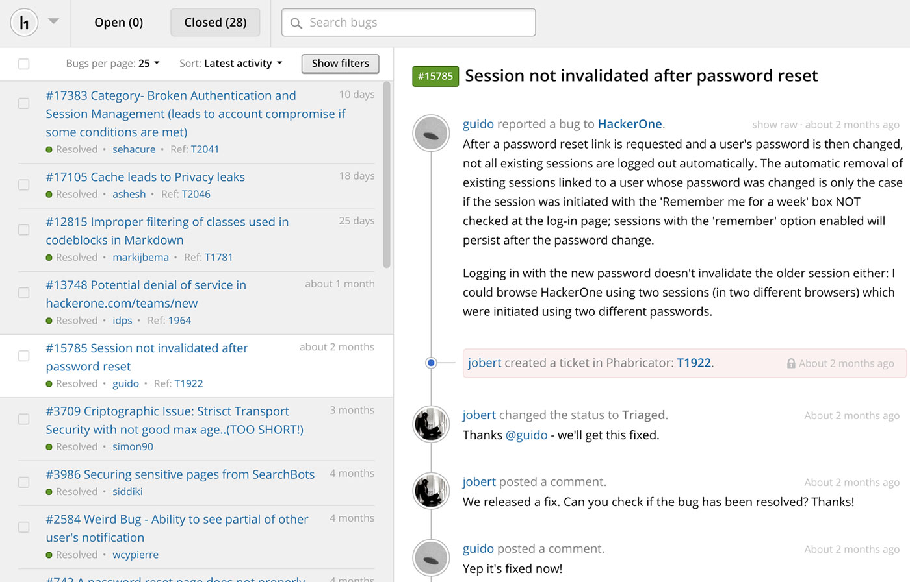
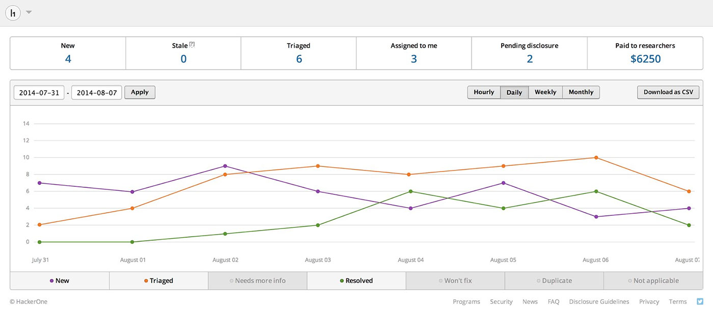
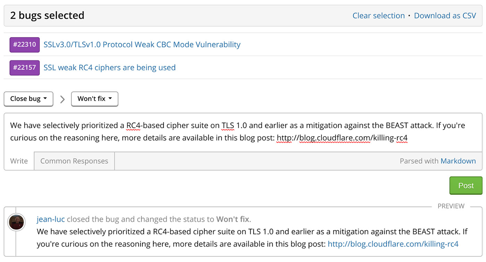

### Security Inbox
We’ve redesigned the security inbox to enable faster bug processing for programs. The new inbox enables programs to open reports inline so you don’t have to click backward or forward to navigate between reports.

### Dashboard
The new dashboard enables insight into your security response posture. This enables programs to be on top of response time, stale issues, pending disclosures and more.

### Bulk Actions
We improve our bulk actions functionality so that it’s easier to apply the same action to multiple reports with a single click.

### Keyboard Shortcuts
We introduce keyboard shortcuts to make the workflow more efficient with a faster navigation.

### Search
Our new inbox filtering search functionality enables programs and hackers to quickly target the bug they're looking for without having to scroll through their inbox.

### Integrations
We introduce these new integrations with HackerOne: <li>MantisBT</li><li>Bugzilla</li><li>Jira</li><li>Phabricator</li>
