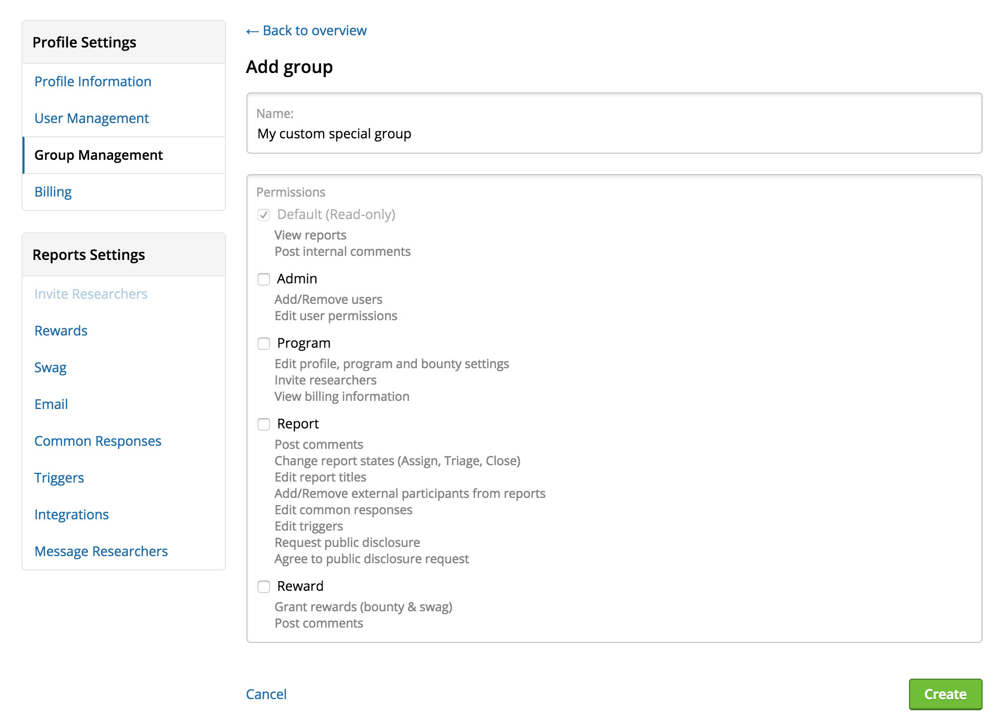
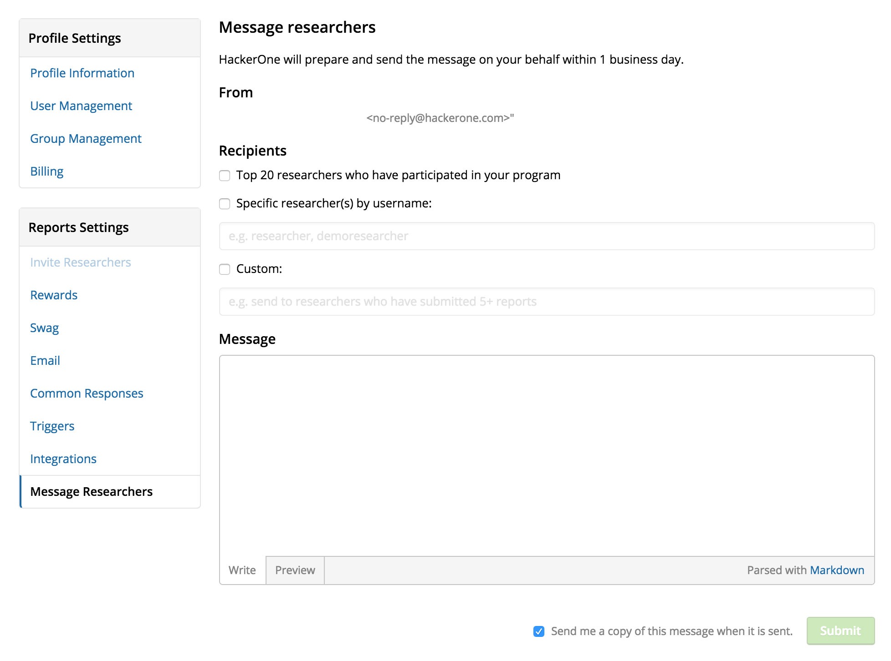
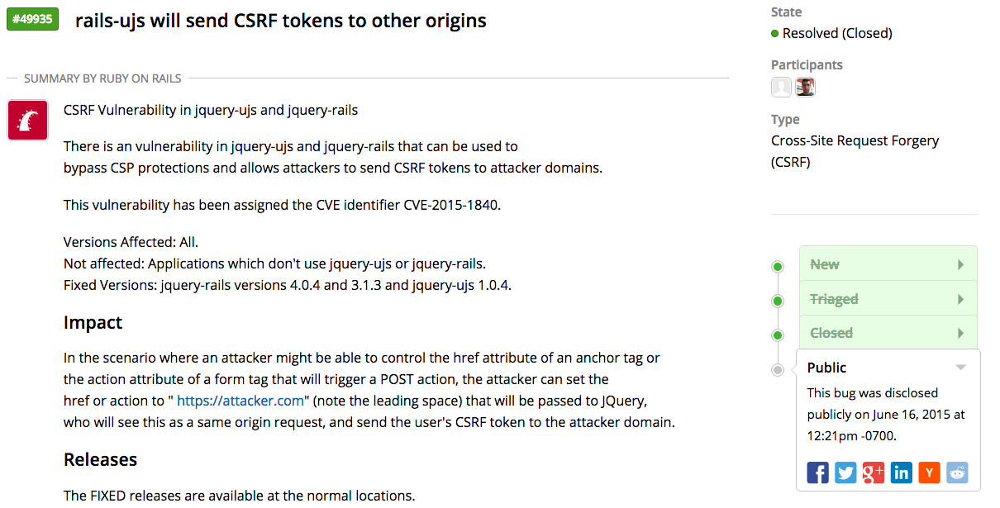

### Permissions
HackerOne program administrators can set access rights for different team members who might play different roles on your team. Learn more [here](/programs/groups-and-permissions.html).

### Message Hackers
With our new Message Researchers feature, programs can now send messages directly to hackers to update them on scope changes, bounty awards, or to just connect with them.

### Disclosure: Limited Timeline and Summary
When an organization chooses to publicly disclose a vulnerability report, there’s now the option to write a summary along with a partial timeline.

