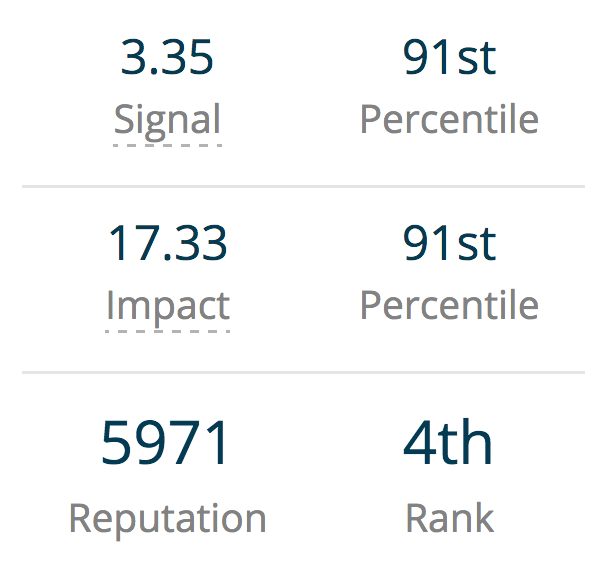
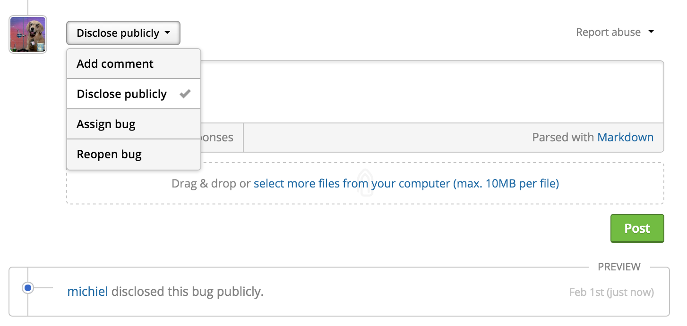

### Signal & Impact
We introduce Signal and Impact so that there can be a more granular understanding of hacker performance. Read our [blog post](https://www.hackerone.com/blog/introducing-signal-and-impact) or check out our [doc](https://docs.hackerone.com/hackers/signal-and-impact.html) to learn more.

### New Default Views
We add these new default views to the inbox to better organize reports:
* Triaged
* Assigned to me
* Pending disclosure
* Pending bounty

### Protective Disclosure
If the response team has evidence of active exploitation or imminent public harm, they can immediately provide remediation details to the public so that programs can take protective action.

### Preview Image Attachments
Programs and hackers can now preview image attachments on the report form.
