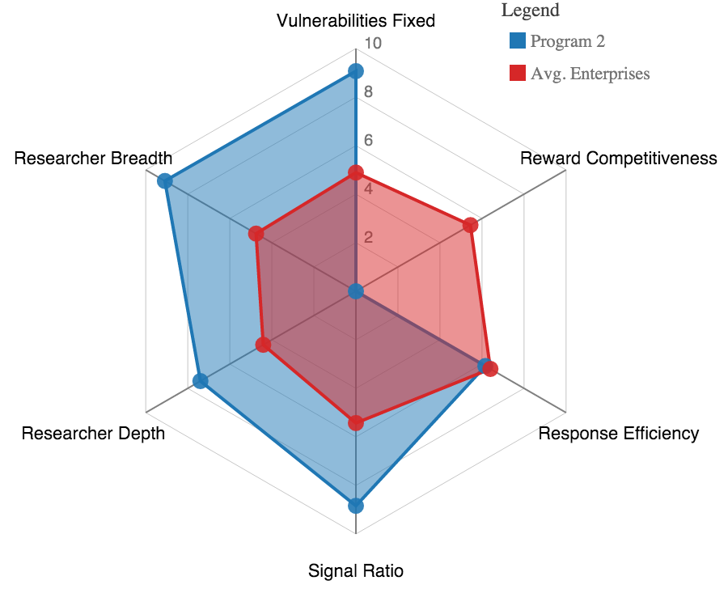
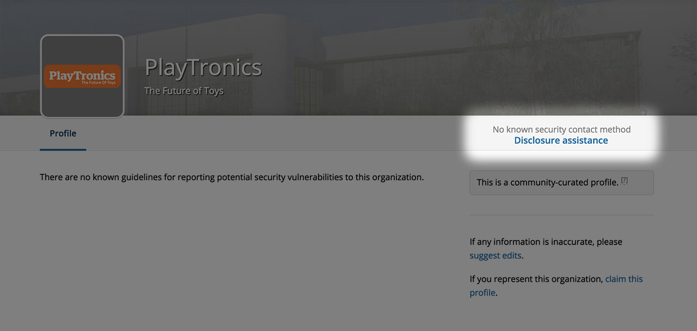
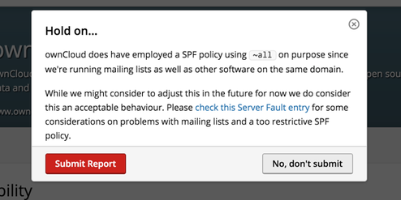
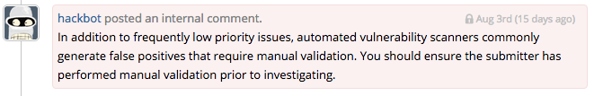
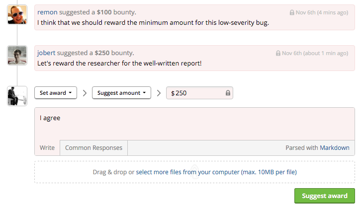
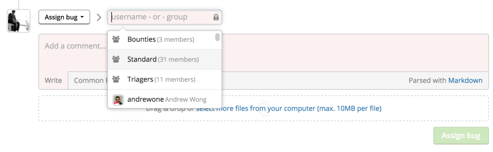
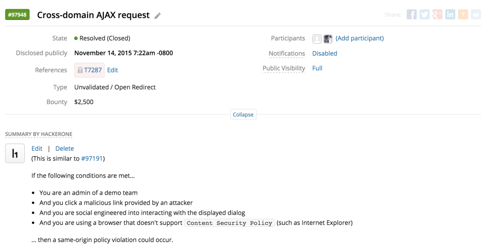

### HackerOne Success Index
We introduce the HackerOne Success Index - a method to measure the effectiveness of HackerOne-powered vulnerability disclosure programs. The index calculates 6 dimensions by which programs can benchmark their success each month. Learn more [here](https://www.hackerone.com/blog/success-in-vulnerability-disclosure).

### Disclosure Assistance
We provide hackers with the ability to request help in contacting an organization with a vulnerability through Disclosure Assistance. This enables HackerOne to take steps to identify the organization’s official vulnerability reporting process. Read more in our [blog](https://www.hackerone.com/blog/vulnerability-disclosure-assistance).

### Trigger: Show Interstitial
We’ve updated our triggers functionality so that an interstitial shows prior to report submission. This helps hackers to avoid the submission of a number of out-of-scope or commonly reported false positives.

### Automated Scanner Detection
We’ve updated our report classification engine to detect common outputs from automated vulnerability scanners that are frequently flagged as invalid. This enables the quality of report submissions to improve as hackers can check the report before submission.

### Single Sign-On: SAML
We’ve improved our Single-Sign-On (SSO) options with support for SAML. Response teams using an SSO provider to authenticate can use those services for centralized authorization and identity management.

### Suggest a Bounty
There’s now a reward suggestion functionality where program members can suggest bounty amounts. This enables programs to more easily arrive at a consensus regarding award amounts.

### Report Abuse
If any disagreements or discussions arise regarding a report, hackers and programs can now request mediation and our experts will provide guidance on the situation.

### Group Assignments
The group assignments feature enables programs to assign reports to a team rather than just to an individual so that multiple people within a team have the ability to pick up the report.

### Improved Report Meta Data
We’ve updated the styling between the report meta data and the summary/timeline so that the report meta data is now collapsible.
   

### Integrations
We’ve added integrations with:
* Slack
* Redmine
* Freshdesk

Read more about how these integrations work [here](https://docs.hackerone.com/programs/supported-integrations.html).
