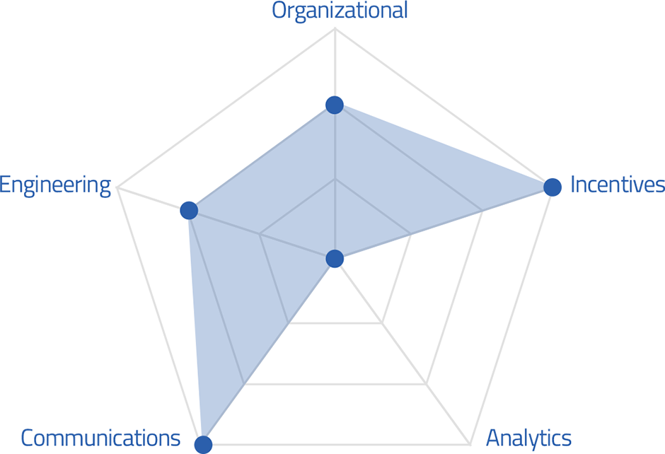

### Vulnerability Coordination Maturity Model
We introduce the Vulnerability Coordination Maturity Model which helps programs increase their dependence on internet-connected software. Learn more about this model in our [blog post](https://www.hackerone.com/blog/vulnerability-coordination-maturity-model
).

### Integrations
We’ve added integrations for ServiceNow and Assembla.

### Tax Forms
We’ve integrated tax forms into our product so that hackers can quickly sign them to get paid.
