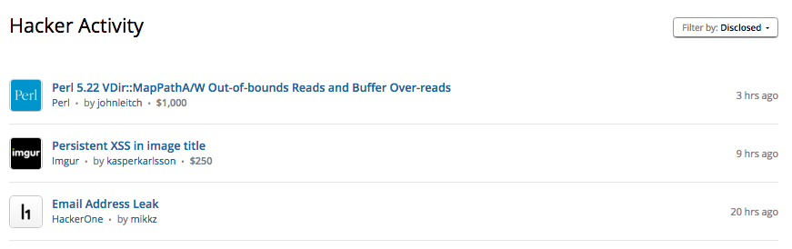
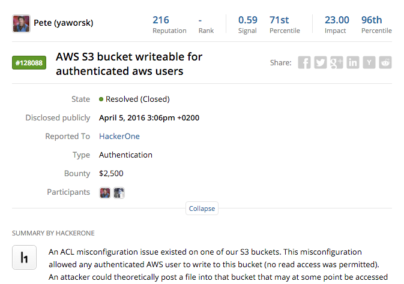

### Automatic Invitations for Private Programs
We now enable private programs to configure a minimum threshold for their report volume under which new hackers will be automatically invited.

### Hacktivity Redesign
We’ve redesigned Hacktivity so that we surface educational reports from interesting hackers.

### Hacker Header on Reports
All reports now include a header with summarized stats on the hacker who submitted the report. The new header fields include:
* The hacker name
* Reputation
* Rank
* Signal
* Signal Percentile
* Impact
* Impact Percentile

