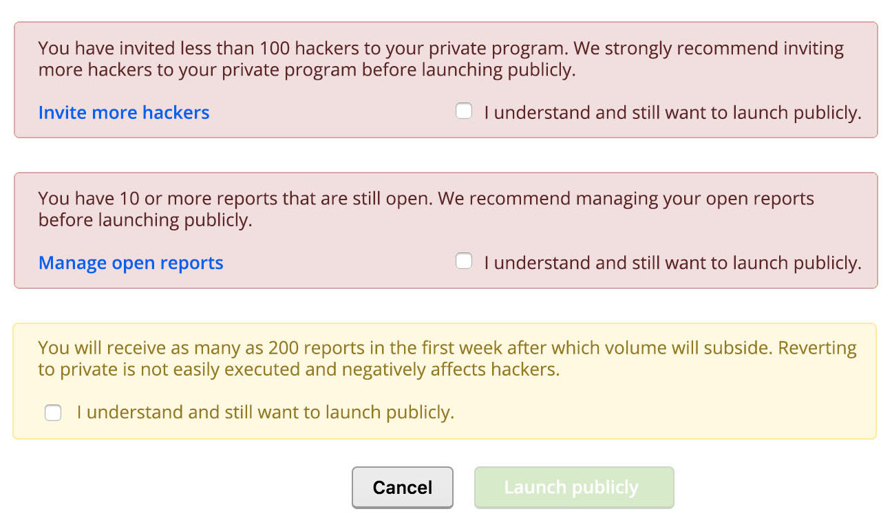
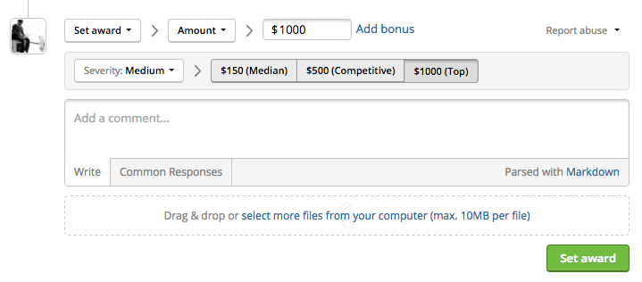
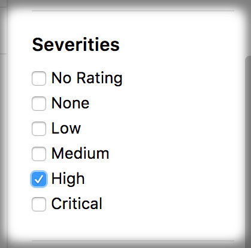
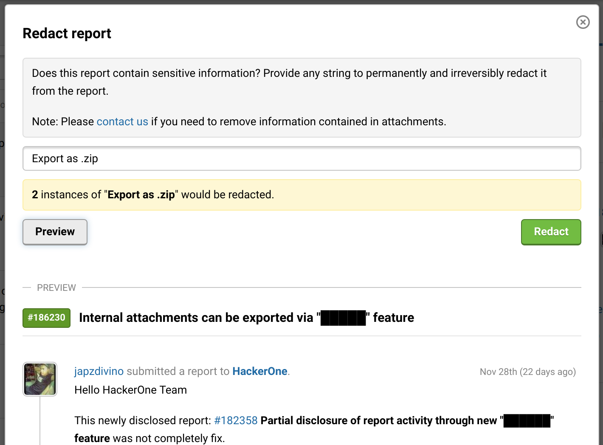
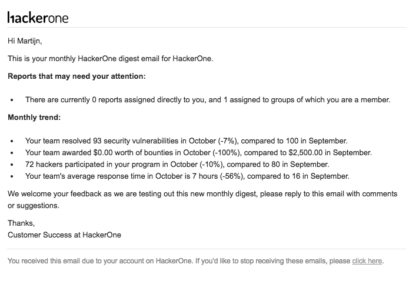

### Clarify Public Launch Expectations
We now set clearer expectations for self-managed programs that decide to publicly launch their program without having met the launch criteria. We supply warning messages showing that the program hasn’t met the recommended criteria and also require them to select the checkbox acknowledging that they haven’t met the criteria but still want to launch publicly.

### Bounty Statistics
When programs award a bounty, we now automatically show them the median, competitive, and top level bounty across the platform for the severity of the vulnerability they are awarding a bounty for. This helps programs to gauge their reward competitiveness and to be as consistent as possible in awarding bounties.

### Filter by Severity
We now enable programs to filter reports in their inbox by severity.

### Redact Sensitive Information from Reports
Programs can now redact sensitive information from reports in a self-service manner.

### Program Updates
We’ve created a new Program Updates tab on the program security page.  Programs can publish and persist updates to their hackers like a mini blog on this tab.

### Monthly Digest Report
We’ve implemented monthly digest report emails so that if a user is a member of an active HackerOne program, they’ll be able to see how their program is performing and gain insight into any changes to their program. They’ll receive this email every first business day of the month. 

