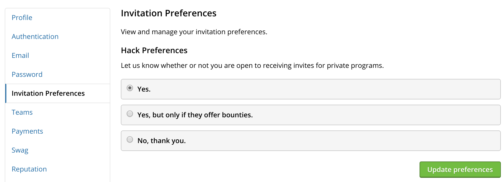

### Hacker Invitation Preferences
Hackers now have the ability to manage their invitation preferences for private programs. They can opt-out of receiving invitations entirely or choose to only receive invites to programs that offer bounties.

