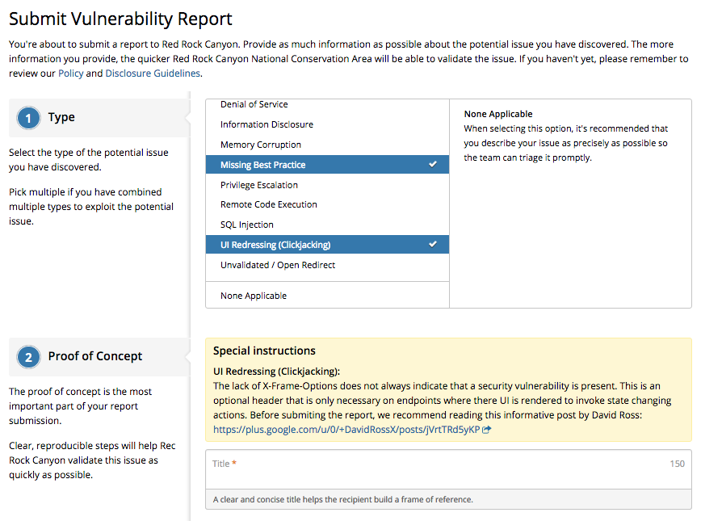
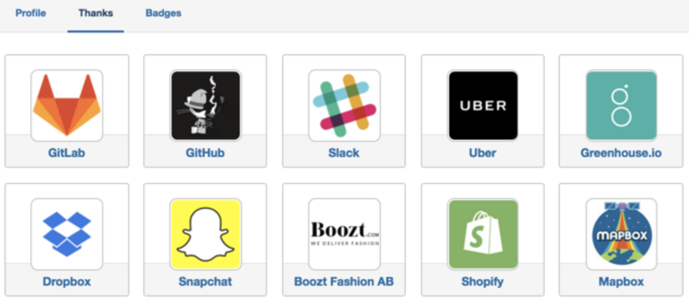

### Custom Vulnerability Types
Programs can now customize their report submission forms with their own introduction text and the ability to hide and disable vulnerability types.

### Hacker Thanks Page
Hacker profiles now include a Thanks page that lists all programs the hacker has submitted vulnerability reports to. For example, check out: https://hackerone.com/atom/thanks

