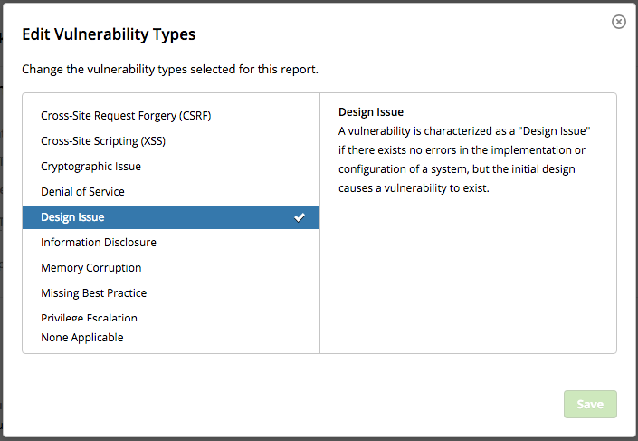
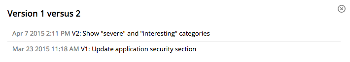

### Edit Vulnerability Type
Programs can now edit the vulnerability type of a report after the report has been submitted. This is to correctly associate a report with the right vulnerability type if a hacker selected the wrong one.

### Policy Versioning
Hackers can now see when the policy was last changed and view all policy changes on a program’s Security Page.

### No More Negative Reputation for “Needs More Info”
We’ve adjusted our reputation system so that reports marked as “Needs More Information” doesn’t result in a -1 reputation hit.

### Hacktivity on Hacker Profiles
We now display all reports hackers have on hacktivity onto their profile page.
