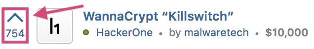
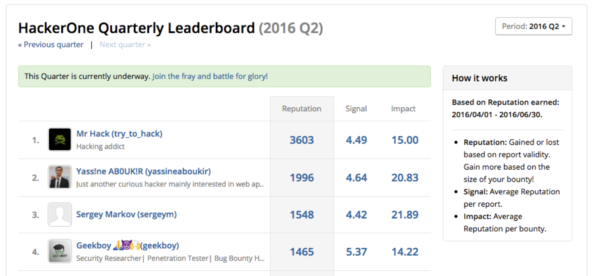
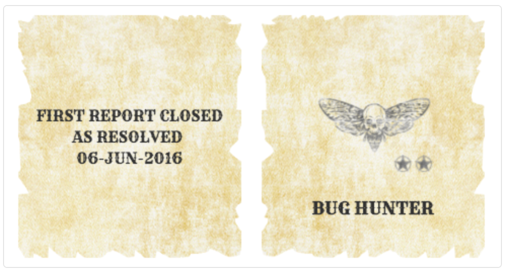
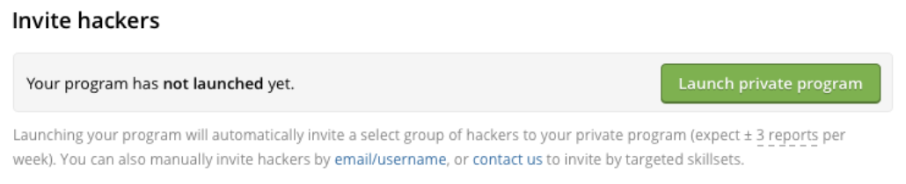

### Hacktivity Upvoting
Users can now upvote reports that they’re interested in in order to create a “Popular” sorting on Hacktivity where reports with the most upvotes are featured on top.

### Hacker Leaderboard
We’ve deprecated the Thanks page at https://hackerone.com/thanks and turned it into a hacker leaderboard that’s segmented into more granular time periods and sortable by Signal, Impact, and Reputation. See who’s on top [here](https://hackerone.com/leaderboard).

### Badges
Hackers can now receive badges when they meet certain criteria or achieve certain events to showcase on their profile.

### API Documentation
We introduce the first version of the HackerOne API to empower programs to build custom metrics and dashboards. Learn more about our [API Documentation](https://www.hackerone.com/blog/launching-the-hackerone-api).

### UI Improvements to Default Automatic Invitations
We’ve cleaned up the UI to Invite Hackers so that it’s clear that there’s a single call-to-action to privately launch a program by turning automatic invitations on.
  
