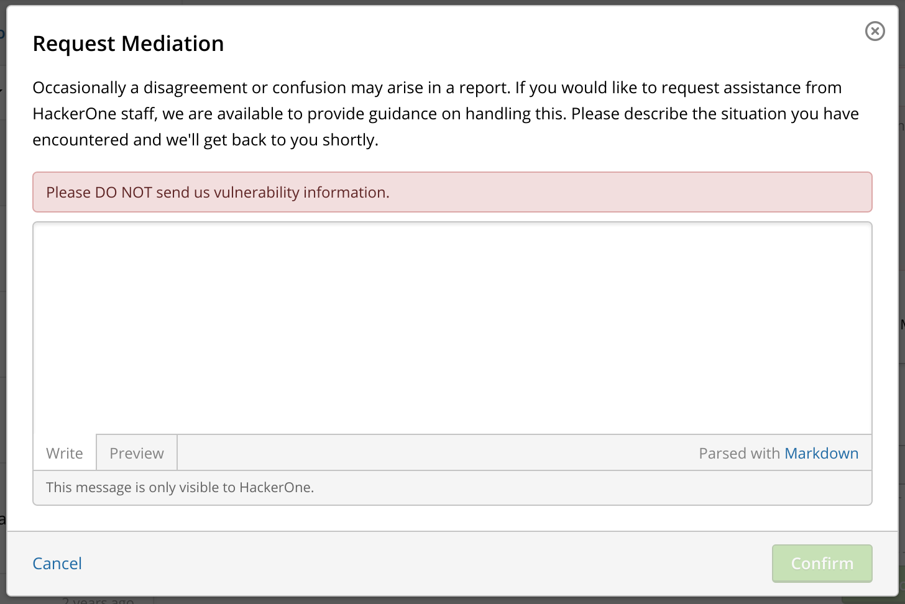
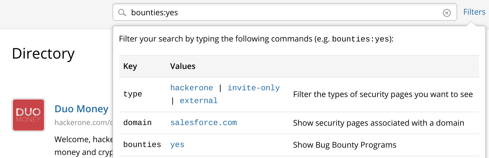
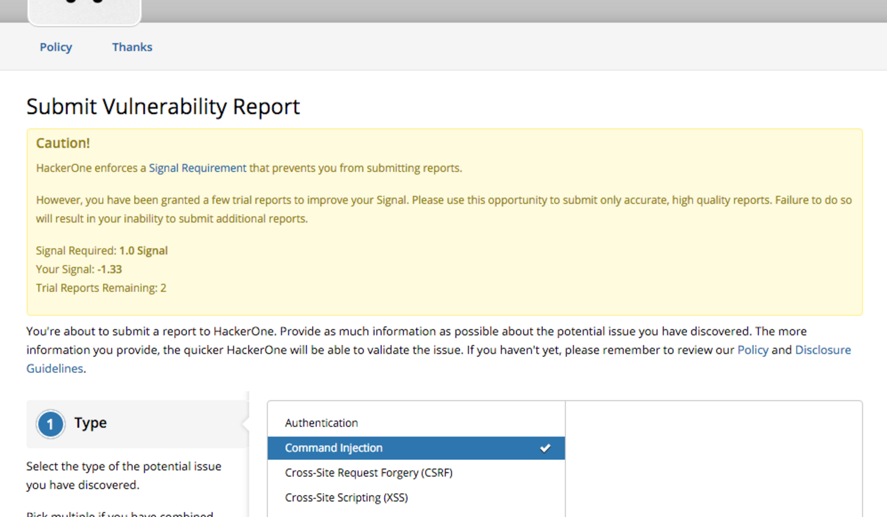
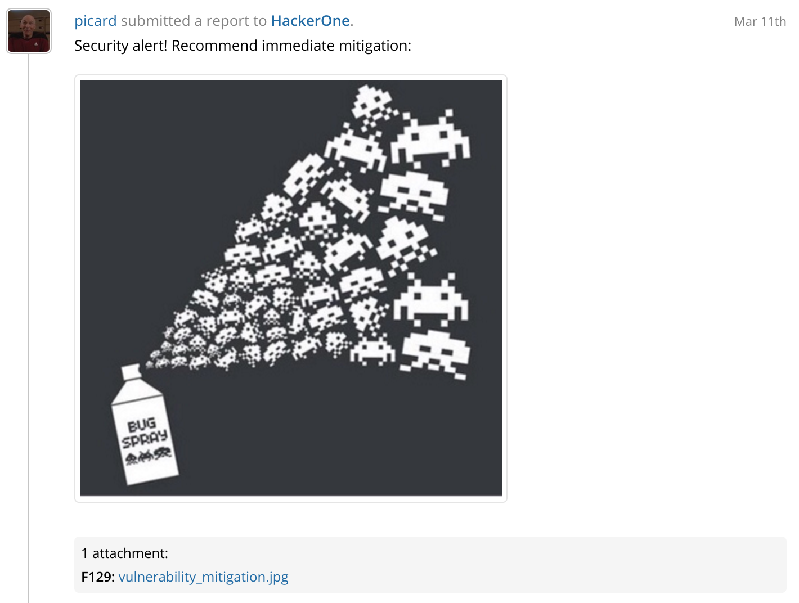

### Mutual Disclosure of All Reports
All reports, including those marked as <i>Not Applicable</i>, <i>Duplicate</i>, and <i>Spam</i> can now be publicly disclosed when both the hacker and the program agree to disclose the report.

### Request Mediation for Hackers
Hackers can now request mediation when they get into a disagreement with a program’s security team.

### Filter Directory by Programs Offering Bounties
Users can now filter the directory by programs offering bounties. Type `bounties:yes` into the search bar to only view the bounty programs in the directory.

### Threading for Notification Emails
We now support message threading for notification emails so that similar emails are grouped together.

### Award Bonus
We introduce the ability for programs to award a structured bonus in addition to the standard bounty for a vulnerability. Read about it in our [blog](https://www.hackerone.com/blog/uber-launches-first-of-its-kind-hacker-loyalty-program-with-hackerone-bonuses).

### Improved Rate Limiter & Signal Requirements
We give programs the ability to tune the Rate Limiter by specifying minimum Signal Requirements for hacker participation. We’ve also updated the Rate Limiter to incorporate additional intelligent inputs.

### Hacker Invitations by Priority
We’ve overhauled the hacker invitation process so that hackers with the highest Reputation, Signal, and Impact will have a greater likelihood of being invited to private programs. Read our [blog post](https://www.hackerone.com/blog/fair-and-transparent-hacker-invitations) to learn more about how invitations work. 

### Inline Image Attachments
We enable programs and hackers to now add inline image attachments to reports and comments.

