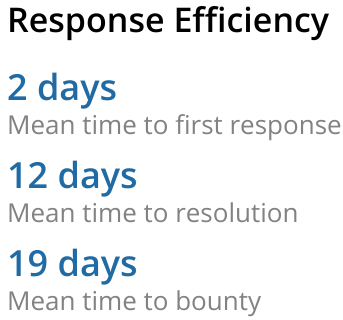

### Security Page Metrics
Programs now have the ability to publicly share Time Metrics and Reward Metrics. These metrics include:
* Mean Time to Response
* Mean Time to Resolution
* Mean Time to Bounty
* Mean Bounty Amount
* Median Bounty Amount
* Total Bounties Paid
 

### Credit Card Payments - Stripe Integration
We now enable programs to make payments using their credit card through our Stripe Integration.
