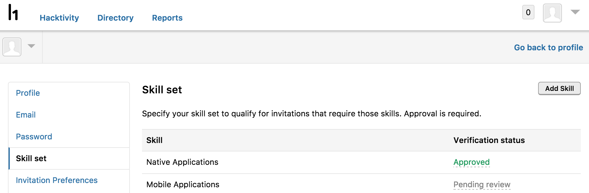
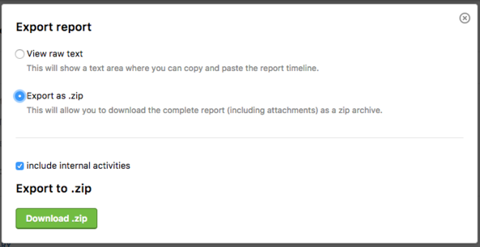

### Hacker Skills
The new Hacker Skills feature enables hackers to identify their skill set which enables them to qualify for invitations specific to their skill sets. Each skill a hacker puts will be verified by HackerOne.

### Configure SLAs for Triage and Resolution
We enable programs to set internal Service Level Agreements (SLAs) by configuring the amount of time that can elapse before a report is marked for their program.

### Change Report State via API
We enable you to change the state of a report through utilizing our API.

### Export as .zip
We provide a new export option where you can download the contents of the report and all attachments in a single zip archive. 

