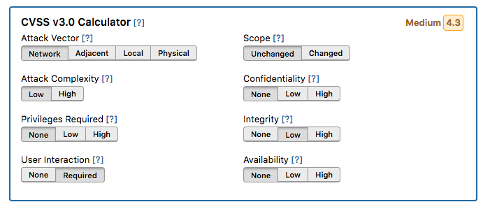
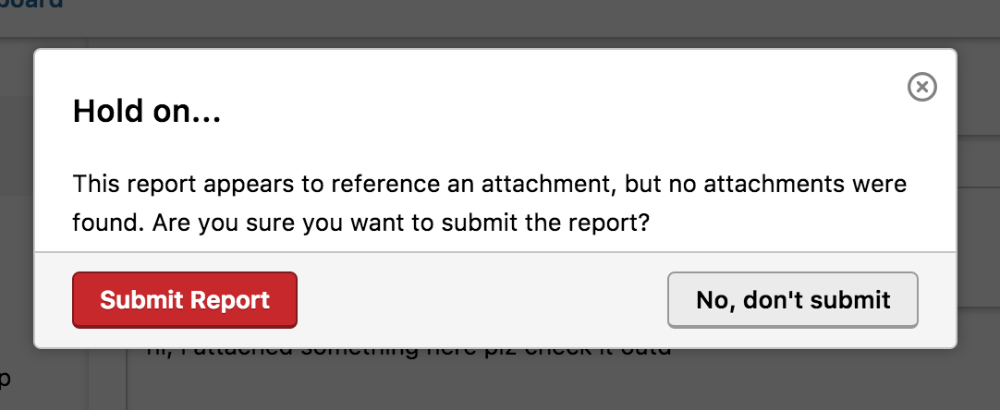
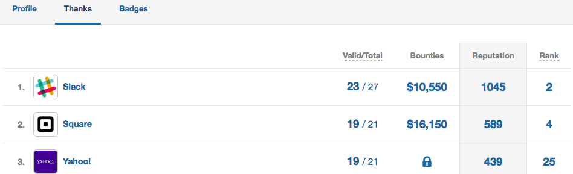

### Hackbot Improvements
We’ve improved HackBot to suggest single-click actions, such as:
* Creating a common response
* Integrating with an issue tracker
* Creating a trigger

### CVSS for Severity
We introduce the ability for both hackers and security teams to set severity via CVSS. Read our [blog post](https://www.hackerone.com/blog/introducing-severity-cvss) or [docs article](https://docs.hackerone.com/programs/severity.html) to learn more.

### No Attachment Warning
We now display a warning message if your report references an attachment but no attachments are found.

### Hacker Profile: Thanks Page Improvements
We’ve totally revamped our Thanks page on the hacker profile so that all the programs hackers have made contributions to, are now listed in the order of most reputation earned. We also display for each program:
* The number of valid and closed reports the hacker has
* The reputation earned
* The rank of the hacker

