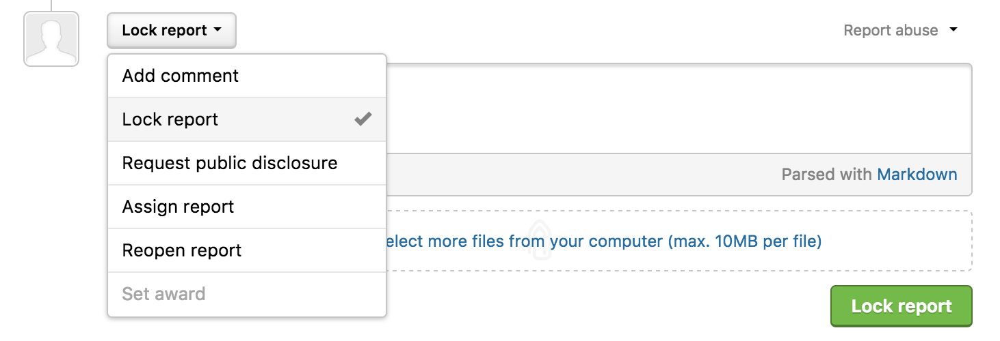
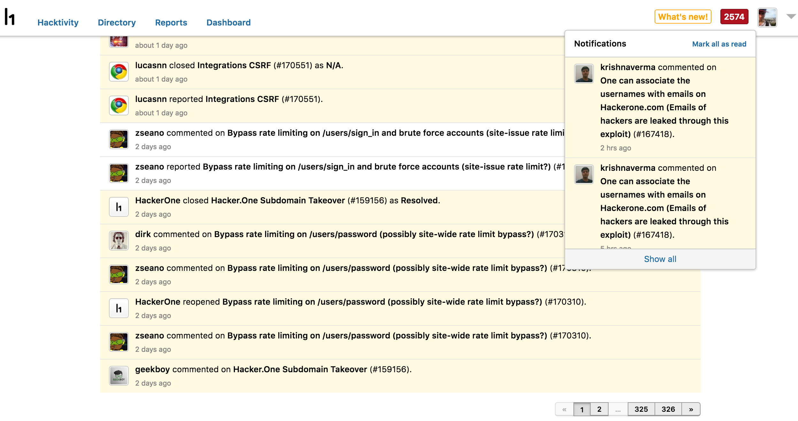
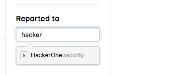

### Lock Reports
You can now lock reports to prevent new comments on publicly disclosed reports.

### Assign Report Through API
Programs can now assign reports to team members using the API. See the API documentation for how to assign a report [here](https://api.hackerone.com/#reports-update-assignee).

### Notifications Page
We’ve created a notifications page so that you can have a clear overview of your notifications. Go to https://hackerone.com/notifications to see your notifications.

### Filter Inbox by Program
Hackers can now filter reports in their inbox by program using the <b>Reported to</b> field so that they don't have to filter through reports with their own eyes.

