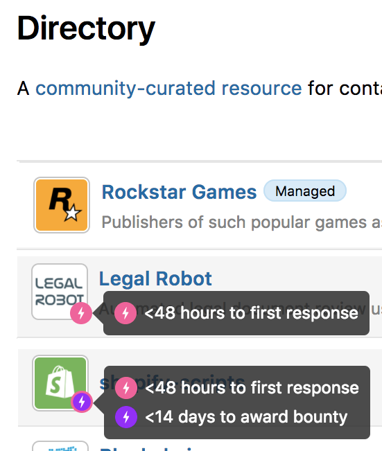
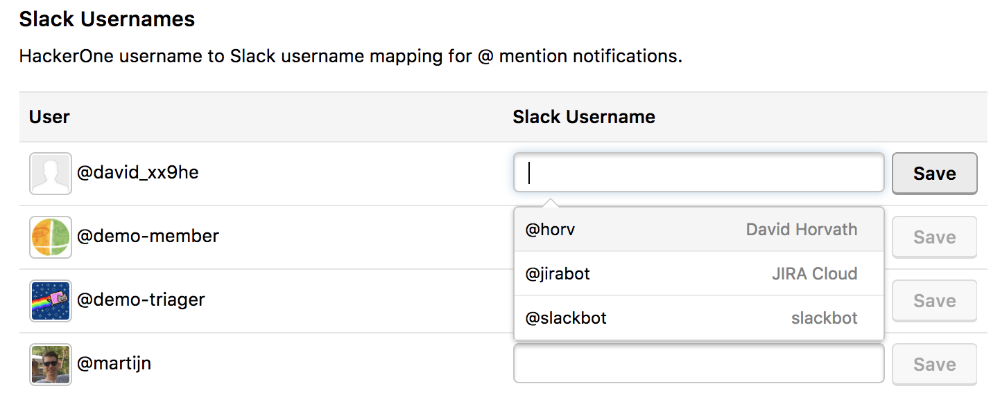

### Directory Icons and Program Badges
The Directory page now includes pink and purple lightning icons to highlight programs that are:
* Fast to respond with a first response in <48 hours on average
* Fast to award by giving a bounty <14 days after submission

We also include a <i>Managed</i> badge to identify programs that are managed by HackerOne.

### Paying out Bounties via the API
Organizations now have the ability to payout and suggest bounties and swag using their internal systems via the API. You can view the API documentation for this [here](https://api.hackerone.com/#reports-award-bounty).

### Slack Integration 2.0
We've revamped our Slack integration so that programs can have:
* Granular notification filtering
* Support for multiple channels
* Notifications when a username is mentioned

Read our [blog post](https://www.hackerone.com/blog/slack-integration-update-2) and learn how to [set up Slack integration](/programs/slack-integration.html).

### Bounty Splitting
We now enable programs to have this feature that enables hackers to split bounties with other hackers that helped them find the vulnerability.
