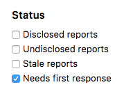
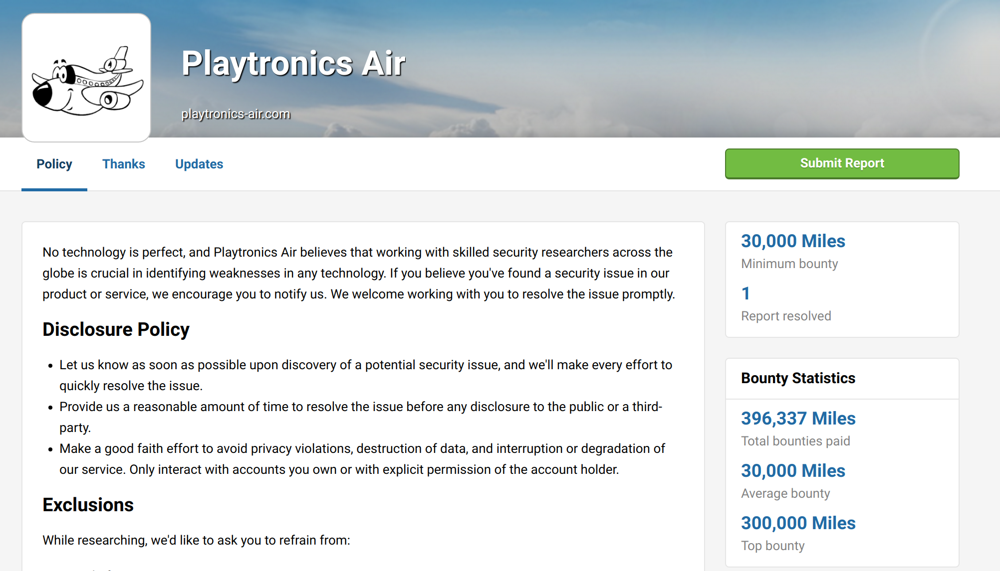
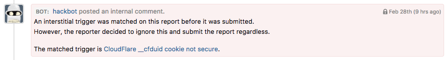

### "Needs First Response" Inbox Filter
We’ve added a ‘Needs first response’ filter to the inbox so that all reports that are still waiting on a public response to the hacker. This helps programs to optimize their time to first response. 

### Award Bounty for External Reports
All program users of the HackerOne API are now enabled to choose to award a bounty for a report that was submitted externally to their HackerOne Security Inbox.

### Custom Integrations for Non-Financial Bounties
We now provide native support for custom integrations with non-financial reward programs such as paying bounties in airline miles. The first user of these new rewards is Lufthansa, which awards bounties in the form of their “Miles and More” program. Please contact your Account Manager for additional information. 

### Report Trigger Matches
We now surface report trigger matches in internal comments to help programs triage a report faster.  

