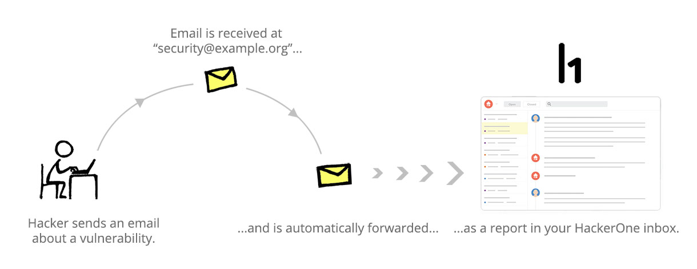
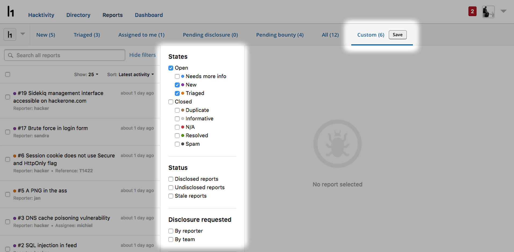
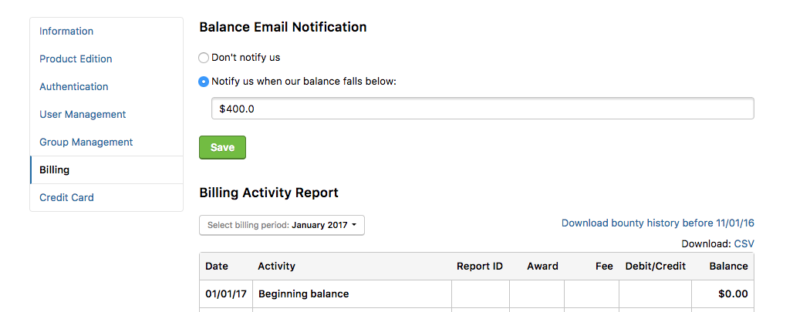

### Security@ Email Forwarding
We enable vulnerability emails sent to programs’ security@ emails to automatically be forwarded as a report in your HackerOne inbox.  

### Custom Inbox Views
We now enable users to create and save their own custom View in their inbox. 

### Trigger for Low Bounty Balance
We now enable programs to set up a trigger for when their balance falls below a certain amount. 

### Inline Video Attachments
We now enable hackers to attach videos to their vulnerability reports. 
