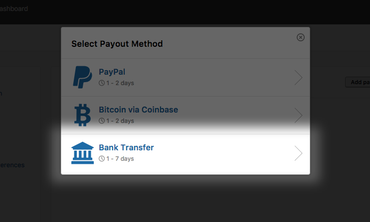
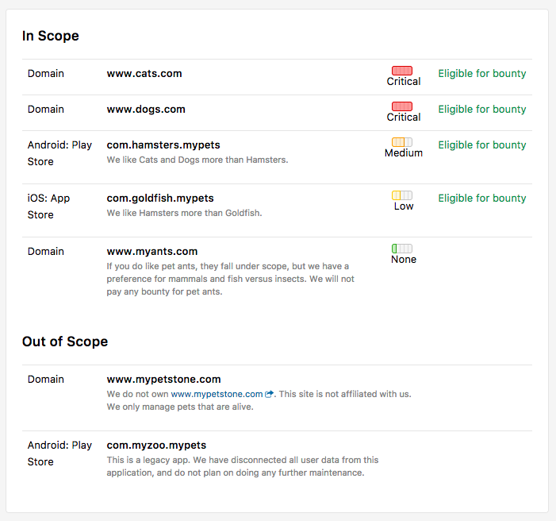
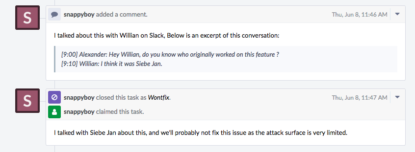

### Bank Transfers via CurrencyCloud
Hackers can now receive payments through Bank Transfers via CurrencyCloud. This enables them to get paid out in 30 different currencies to almost any country in the world. 

### Scope
Programs can now define their scope and the list of assets they want hackers to test. This controls what reports can be submitted and helps to prevent noise. Don’t know what a scope is? Learn more [here](/programs/defining-scope.html).

### Hacker Reviews
Programs now have the ability to review their hackers and to comment on their behavior. Learn more about [hacker reviews](/programs/hacker-reviews.html). 

### Bi-Directional Phabricator Integration
We now provide programs with a two-way integration that syncs changes between HackerOne and Phabricator. 

### Hackathon Inbox Filter
During hackathon events, programs can now filter reports in their inbox specific to the hackathon so that these reports can be focused on.

### Onboarding Changes
We’ve updated the words programs encounter when they onboard onto our platform to reflect our new product changes. 
