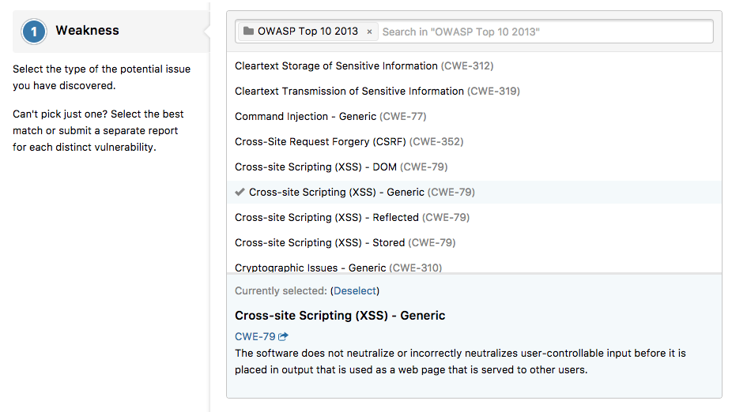

### CWE Weakness for Vulnerability Types
We've updated our vulnerability taxonomy to include a more complete weakness suite based on the industry-standard Common Weakness Enumeration (CWE). This provide a much more complete and accurate description of a reported vulnerability, and more importantly, it adopts a common language that is endorsed by the security community.

### Disclosure Assitance with Vulnerability Report
HackerOne will now triage and validate disclosure assistance vulnerability reports by severity in order to expedite the disclosure assistance process. 
