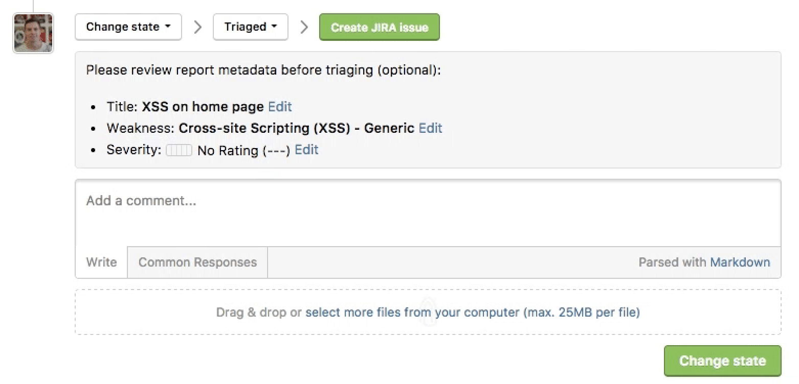
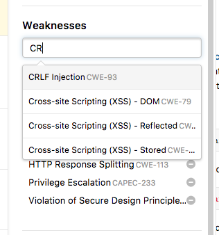

### Bi-Directional Jira Integration
We now provide a bi-directional Jira Integration where Jira users can sync specific workflows from Jira to HackerOne and vice versa, from HackerOne to Jira. 

### Move Report Between Programs 
Organizations running multiple programs are now able to transfer reports between programs to make sure the vulnerability is associated with the correct program. 

### Filter Reports by Weakness
You can now filter your reports by specific weaknesses in your inbox. 

### Beta Hacker VPN
We've implemented a hacker VPN that:
* Controls traffic to in scope program assets
* Enforces granular access controls with a 1:1 mapping between an individual hacker and a static IP
* Pauses individual hacker access without interruption to the overall program
* Integrates with a program's monitoring tools to have full visibility into program activity 

Contact [HackerOne](https://support.hackerone.com/hc/en-us/requests/new) to participate in this beta. 
