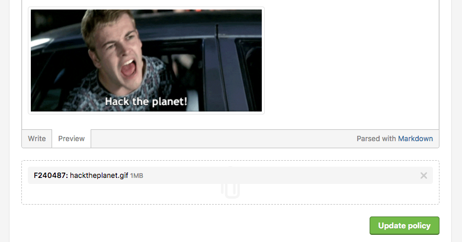

### Inline Image and Attachments on the Security Page
We now enable you to attach pictures and other files to your policy. Simply go to your program's <b>Settings > Policy</b> and there will be a field where you can upload your files. We've got a nice giph on ours. [Check it out](https://hackerone.com/security).

