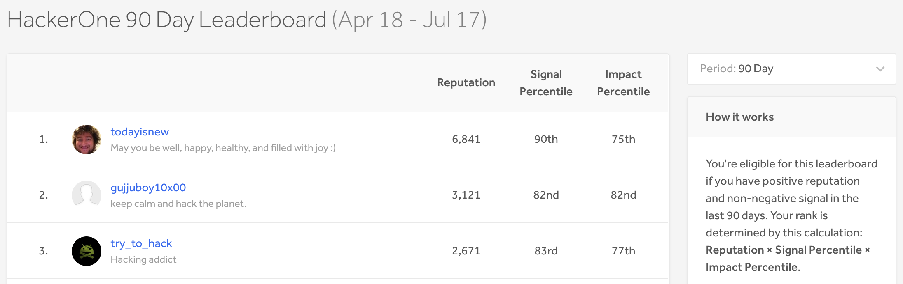
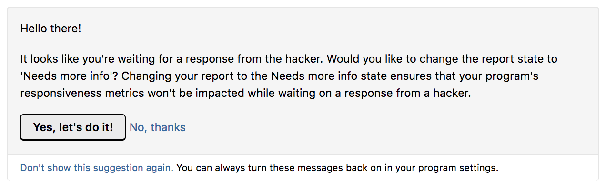

### The 90 Day Leaderboard
The new rolling 90 day leaderboard ranks hackers based on their score from this calculation: **Reputation x Signal Percentile x Impact Percentile**. 

### Needs More Info 
When a program member adds a comment to an open report with a question mark, Hackbot will prompt them asking if they want to change the state of the report to Needs more info. 

### Response Efficiency Timers
Response efficiency timers no longer trigger for reports submitted by internal members of the program. 

### Auto-Invites for Controlled Programs
Programs in controlled launch mode are no longer able to toggle auto-invites as on or off. To change their settings for invitations, they can contact HackerOne support. 

### Bug Fixes
* URLs in the report title are now wrapped so that they aren’t crossing out of the inbox. 
* The Program Health Dashboard now displays 0 instead of N/A when there are no missed or failed reports. 
* When a hacker leaves a program that they got invited to through the email forwarding feature, they won’t be placed in the priority queue for leaving that program. This prevents hackers from harvesting a ton of private invitations. 
* Hackers now don’t receive invitations to programs they’ve left. 
* When hackers received an invitation to claim a report, they couldn’t see or accept the terms of the program. Now they can actually claim the report and see the terms of the program. 
