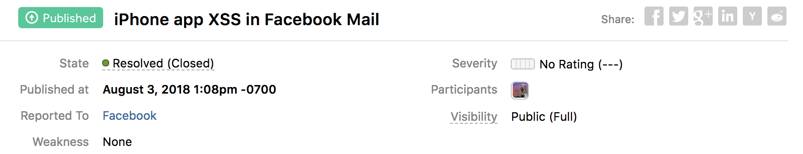
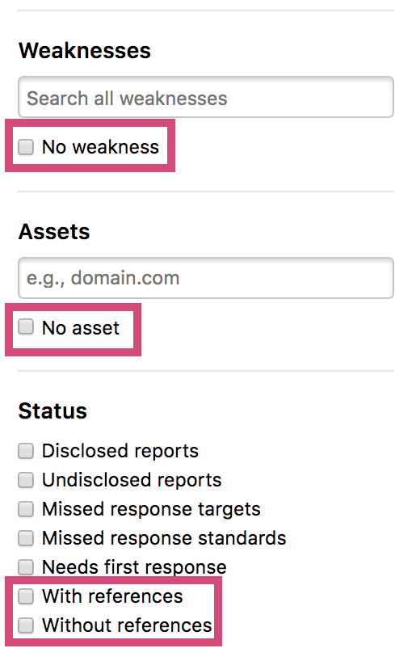
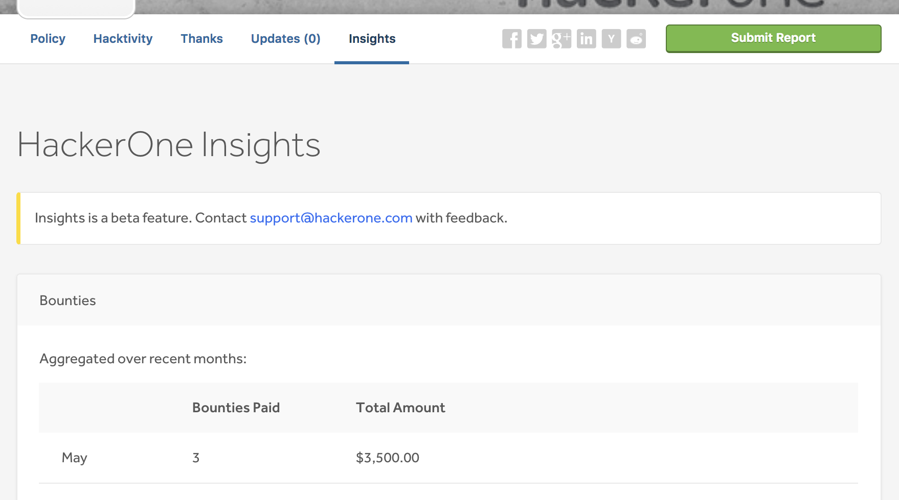

### Publishing External Vulnerabilities
We now enable hackers to publish their findings from external sources that don't have HackerOne programs. Click [here](/hackers/publishing-external-vulnerabilities.html) to learn more.

### Two-Factor Authentication
Hackers now have the ability to set up [two-factor authentication](/hackers/two-factor-authentication.html) to add an extra layer of protection to their accounts.

### Inbox Filters
Programs can now filter reports with these new inbox filters:
* No weakness
* No asset
* With references
* Without references

### Insights (beta)
We introduce the insights page to provide hackers with helpful statistics about programs they're contemplating to hack on. The  information is provided to help hackers focus their efforts on the right assets for the right programs. Categories of insights include:
* Bounties
* Reports
* Hacker Participation
* Top 10 vulnerabilities
* Scope Severities

