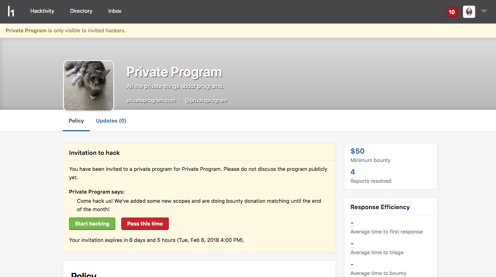
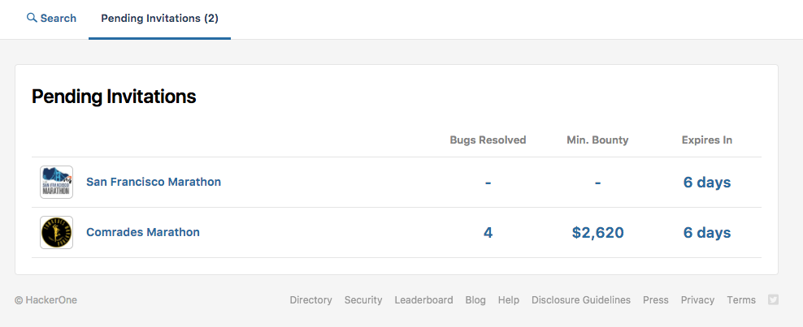
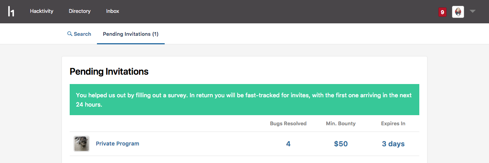

### In-Product Notifications for Invites
The notifications corner now pings hackers about new invitations.

### Invitations on the Program’s Profile
Hackers can also see their invitations on the program's profile page. This reminds hackers of their invitation when they go to look at the program.

### Pending Invitations Page
The new Pending Invitations page enables hackers to view all of their pending invites in one place so that they can see all the invitations they need to take action on.

### Rejection Questionnaire
When Hackers reject an invite, they are given the opportunity to fill out a questionnaire to provide HackerOne with feedback on why they decided to reject the program invitation. The questionnaire shows up directly after hackers reject the invitation.

### Leave Program Button
The Leave Program button is updated to be on the sidebar of the program’s security page. Hackers that leave the program also also get an invitation to fill out the rejection questionnaire.

### Priority Queue
Hackers that submit the rejection questionnaire are placed at the top of the queue for the next program invitation they qualify for.

### Private Invite Notification
The notification to private invites is updated so that it doesn't look like a program member invite.

### Response Efficiency Box
The Response Efficiency box is updated on the program security page to show that metrics are averages of the last 90 days.

### Response Efficiency Indicator
There is now a response indicator in the Response Efficiency box of the program's security page to show how healthy a program is. The indicators are either green, orange, or red dots.

### Bug Fixes
- Hackers are no longer redirected to a deleted program after every login.
- Programs can mark reports as being ineligible for bounty even though a hacker account is disabled.
- The program health alerts are fixed so that you're not getting alerted when you have 0 reports failing SLAs.
- Old resolved reports are no longer marked as SLA Fail or SLA Miss.
