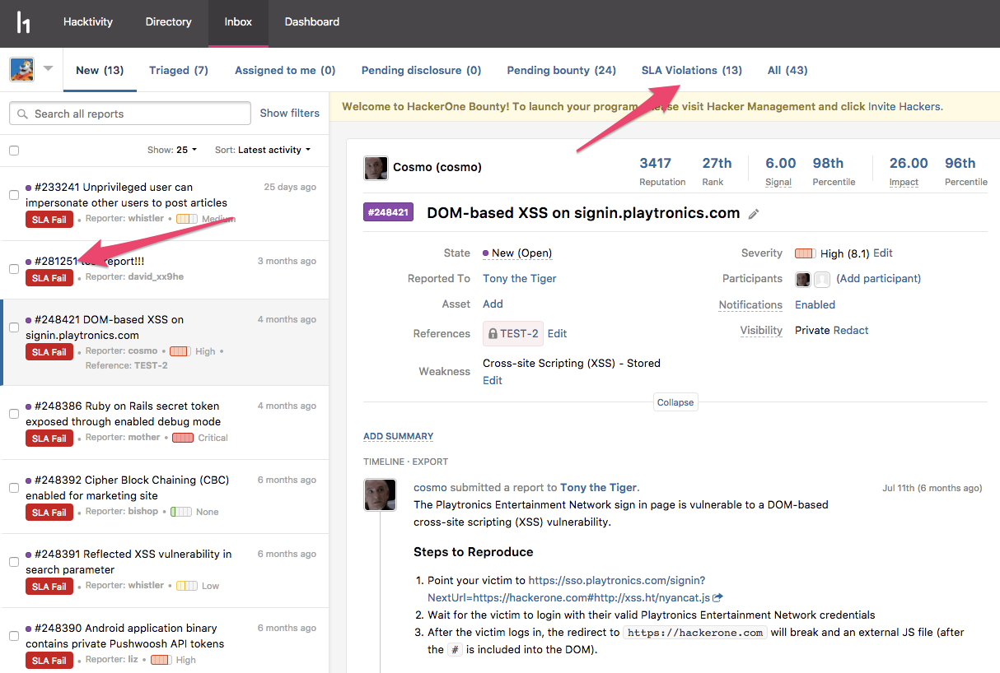

### Human Augmented Signal
We enable programs to utilize the expertise of HackerOne Security Analysts to review those pesky invalid reports so that programs don’t have to deal with them. Learn more about [Human Augmented Signal](/programs/human-augmented-signal.html). 

### Response SLAs 
You can now set your response service level agreements (SLAs) for time to first response, time to triage, time to bounty, and time to resolution. What do all these terms mean? Find out [here](/programs/response-target-metrics.html).

### Response Efficiency Indicator
We now display a colored indicator on a program's security page to show hackers how responsive a program is to report submissions.  

### SLA Inbox Labels
If you forget which reports aren't meeting your response SLAs, we now have <i>SLA Miss</i> and <i>SLA Fail</i> labels as well as a new SLA Violations view in your inbox to show which reports need action. 

### Pausing Report Submissions
Want to take a break or need time to catch up on existing reports? Programs can now pause from accepting new report submissions.
