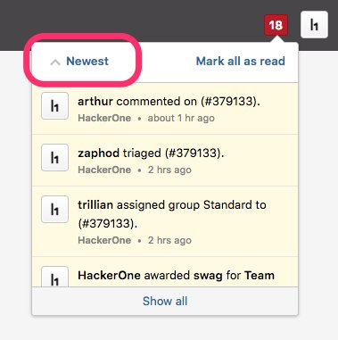
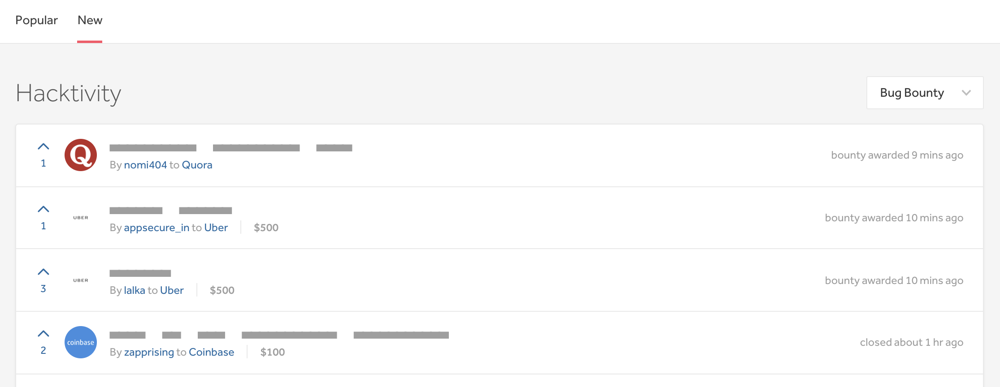

### Hacker Email Alias
All hackers now have an [email alias](/hackers/hacker-email-alias.html) that forwards emails to the email address they’ve registered with on HackerOne. This provides an easy way for programs to contact you in order to share credentials and information without having to access your actual email address.

### Sort Notifications
You can now sort notifications from oldest to newest and vice versa.

### Hacktivity Redesign
We've revamped the look of our [Hacktivity](https://hackerone.com/hacktivity) feed so that it has a sleeker design. We've also deprecated the <b>Top</b> tab on Hacktivity.

### Bug Fixes
* Hackers that have submitted a report and left the program can now revisit the report without seeing any errors.
* The reworded the notification for invites to private programs so that it's clear that it's an invitation.
