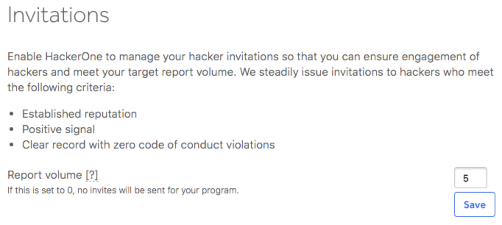
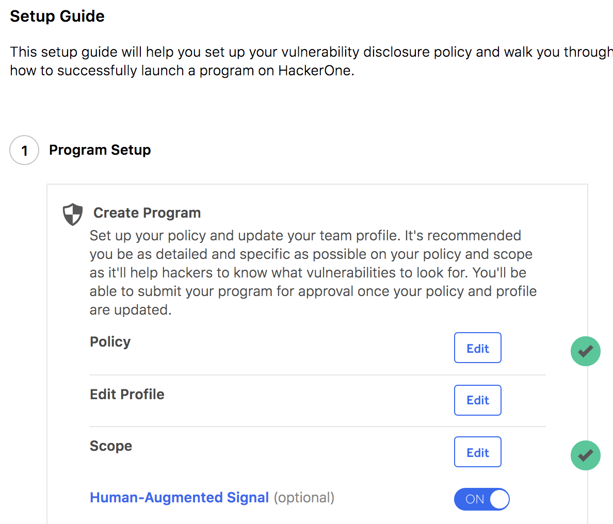
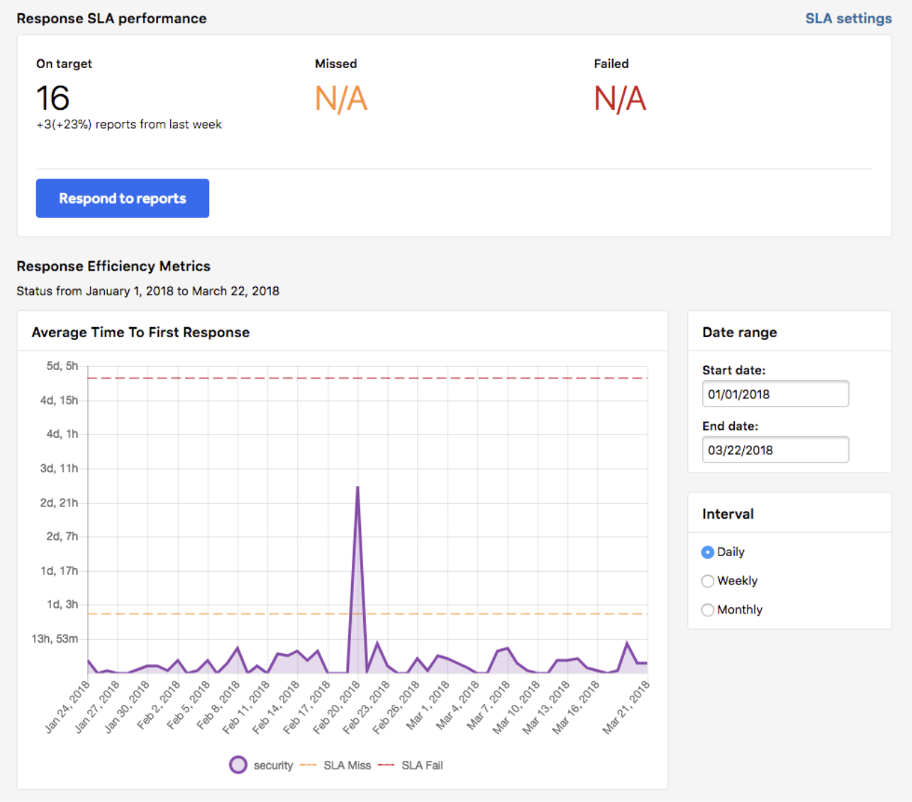

### Invitations
We’ve improved the way programs can manage their invitations to hackers. You can now set a report volume target where we’ll monitor and manage your hacker invitations to help you meet your report goal.

The Invite Hackers tab under Settings > Program > Hacker Management has been renamed to Invitations.  

The Invitations page includes the new Report Volume field where you can enter the number of reports you'd like to receive in 30 days.

[Read more about Invitations](/hackers/invitations.html).

### Needs More Info
Reports in the Needs More Info state that haven’t been responded to within 30 days automatically get closed with no negative impact to the hacker’s reputation.

### Self-Controlled Launch
Response Programs in Controlled Launch that meet all of the success criteria are now prompted to publicly launch their own program through following the Setup Guide or through email notification.

### Response SLA Settings
Response SLA settings are now applied to all reports and not just reports created after modification to SLA settings.

Response SLA settings are also now incorporated into Controlled Launch for Response programs. Programs must’ve received at least 10 reports and invited 100 hackers while maintaining healthy responsive times before launching publicly.

### Program Health Dashboard
The new Program Health Dashboard helps programs track their Response Efficiency Metrics and Response SLA performance. Go to Dashboard > Program Health to view your metrics.

### Response Efficiency Indicator
Programs can now see their response efficiency indicator in their program dropdown. This enables them to see their response efficiency status without having to visit their security page.

### Bug Fixes
* Invite notifications don’t show up again for expired, declined, and duplicate invites.
* The questions on the Invitation Rejection Questionnaire and the Leave Program Questionnaire no longer show duplicates.
* The Time to Bounty timer now pauses when a report is closed as either N/A, Duplicate, Informative, or Spam.
* The red response efficiency indicator tooltip now correctly states that the program has failed SLAs instead of missed SLAs.
