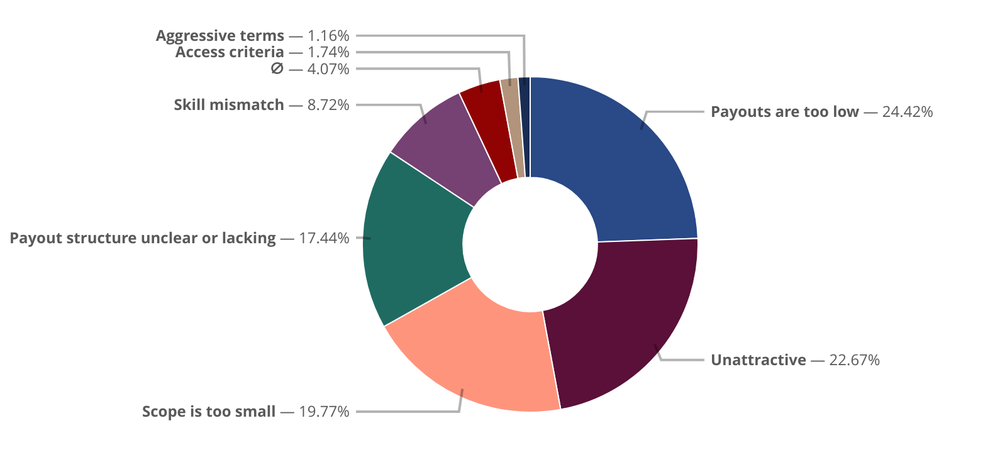
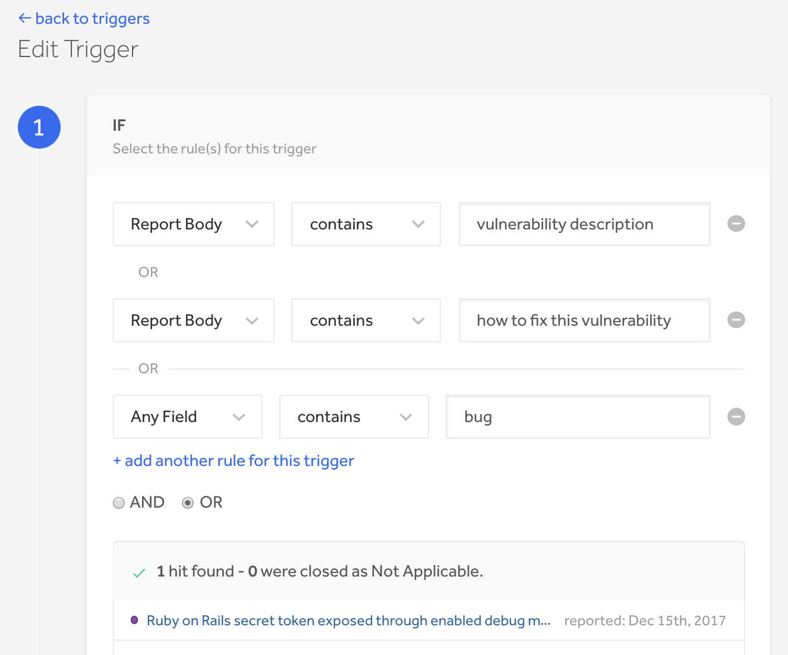
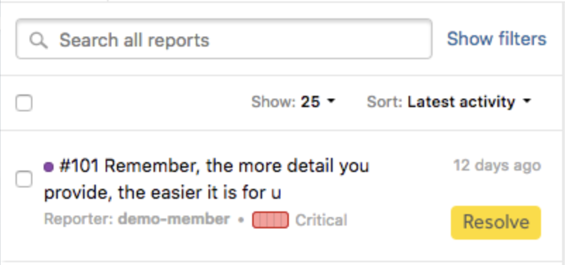
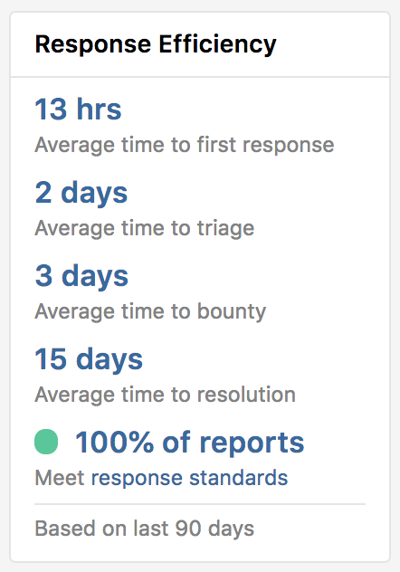
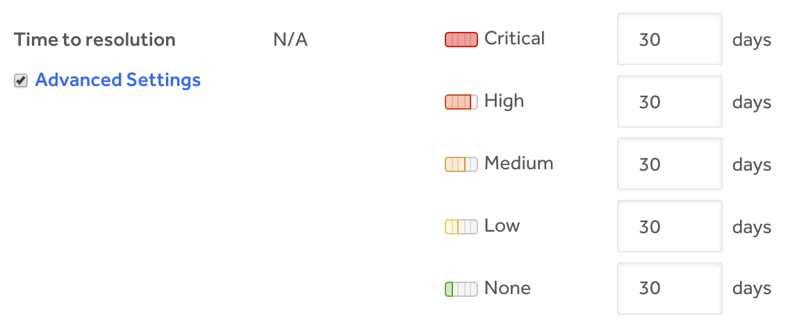

### Hacker Feedback Dashboard
We introduce the new Hacker Feedback Dashboard where private programs can see the total feedback their program has received from hackers along with the reasons they’ve declined to participate in their program. The feedback can be viewed at <b>Dashboard > Feedback</b>. Learn more about the [feedback dashboard](/programs/hacker-feedback-dashboard.html).

### Triggers
We've revamped our [triggers](/programs/triggers.html) functionality so that you can: 
* Preview matches for a new trigger
* Add <i>And/Or</i> conditionals to make the trigger more flexible
* Edit or build off of default triggers

We've also updated the design so that you'll have a better user experience.

### Response Targets 
We’ve deprecated the threatening term, <i>Response SLA</i> and replaced it with the more friendly terms, <i>Response Targets</i> and <i>Response Standards</i>. [Learn more about these new terms](/programs/response-targets.html). 

We’ve deprecated the <i>SLA Violations</i> inbox view and changed the name to <b>Missed targets</b>. The inbox filters are also now <b>Missed response targets</b> and <b>Missed response standards</b> instead of <i>SLA violation reports</i> and <i>SLA Fail reports</i>. 

We introduce 4 new inbox labels for reports that don’t meet response standards or targets. The labels are: Response, Triage, Bounty, and Resolve. These labels replace the previous <i>SLA Fail</i> and <i>SLA Miss</i> labels. 

The fields on the Reponse Target performance section of the Program Health dashboard have changed to <b>On target</b>, <b>Missed target</b>, and <b>Missed standard</b>. The missed target line is also taken off of the Average Time to Resolution graph on the dashboard.

### Response Efficiency Indicators
We’ve modified response efficiency indicators so that:
* They now let you know the program’s percentage of reports that meet response standards instead of the number of reports that are failing or missing SLAs. 
* The indicator and metrics are visible even when a member of the program is signed out. 
* The orange response efficiency indicator is now changed to yellow.
* The indicator now occurs at the bottom of the metrics chart instead of at the top.

### Time to Resolution by Severity
We now enable you to set your Time to Resolution response standards by severity. Learn more [here](/programs/setting-response-targets.html). 

### Invitations Toggle
Programs no longer have the ability to toggle invitations on or off with the On/Off button. The equivalent action to turn invitations off is to set the report volume to 0 if they no longer wish to engage with new hackers. To turn invitations on, just increase the report volume to be greater than 0. 

### Policy and Scope
Policy and Scope now have their own separate sections under <b>Settings > Program</b>. 

### Bug Fixes
* The Managed label no longer shows up on the directory for programs with expired triage subscriptions.
* The response standard percentage now displays when the display option setting is enabled. There were some incidences where it didn’t show in the past. 
* When a large user profile photo is uploaded, an error message is now given to the user to notify them that the upload has failed. 
* Social sharing icons on public programs are now aligned and work properly without any weird spacing issues between the icons. 
* Hackers no longer receive automatic invitations for programs they’ve left. 
