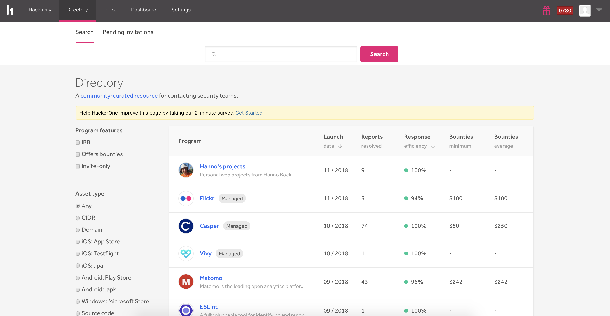
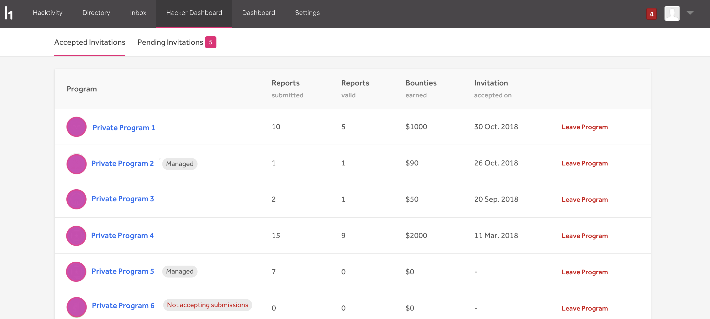

### Revamped Directory
We've totally revamped our directory page so that you can better search and view programs. You can now filter your search results by program features and asset type, and we also enable you to view various stats for each program on one page. 

### Hacker Dashboard
Our new [Hacker Dashboard](/hackers/hacker-dashboard.html) enables hackers to better manage and review their accepted and pending invitations. 

### Disclosure 
We've deprecated the term "Public Disclosure" and now simply just call it 
[Disclosure](/programs/disclosure.html).

### Disclosure for Private Programs (beta)
Private programs can now opt-in to enable hackers to disclose reports to other hackers within their program. Upon disclosure, contents of the report will only be visible to participants within that private program. This enables hackers to share their vulnerability findings with other hackers in the program, and can also increase awareness for other hackers as they can better see what vulnerabilities have already been found for the program. 

### Retesting 
We've globally launched our [retesting](/programs/retesting.html) feature so that all programs can now initiate retests on any of their resolved reports. Invitations for retests now expire after 24 hours, and hackers are now required to provide a short summary of how they retested the vulnerability. Hackers can also provide attachments of their findings.  

