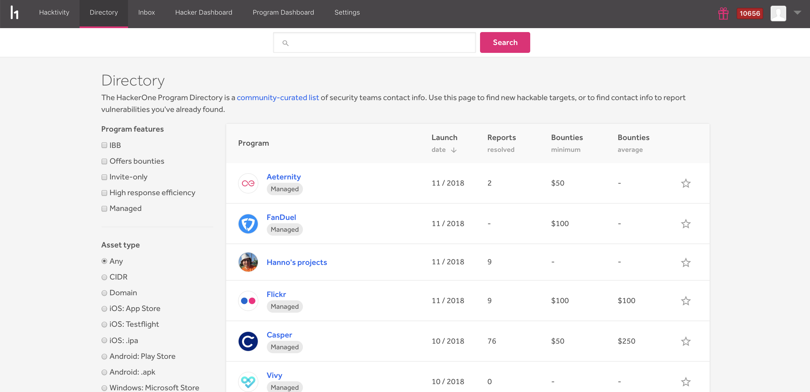
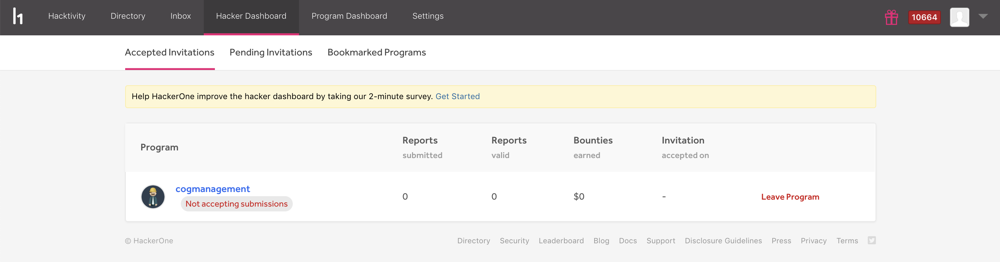
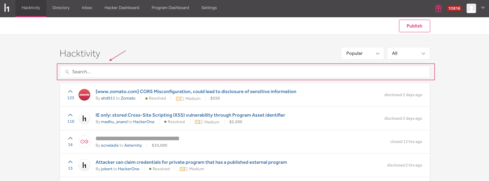
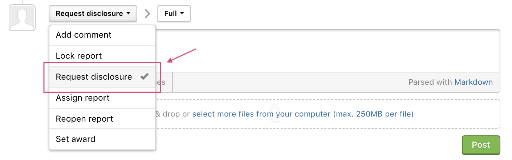
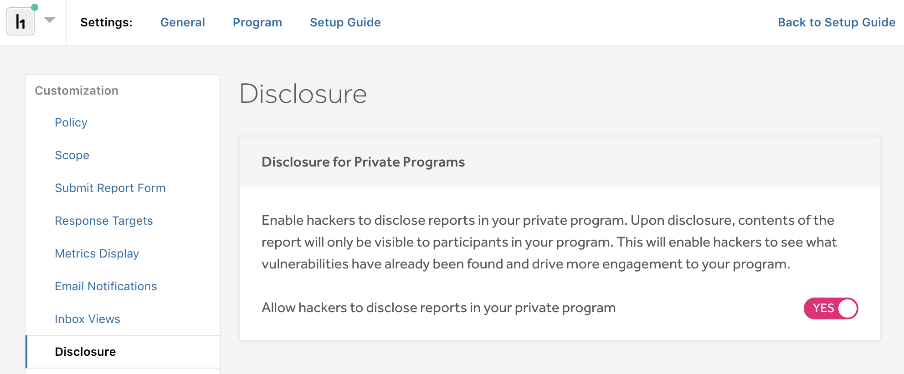
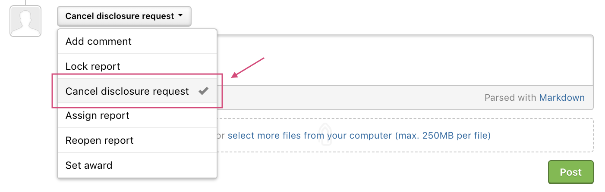
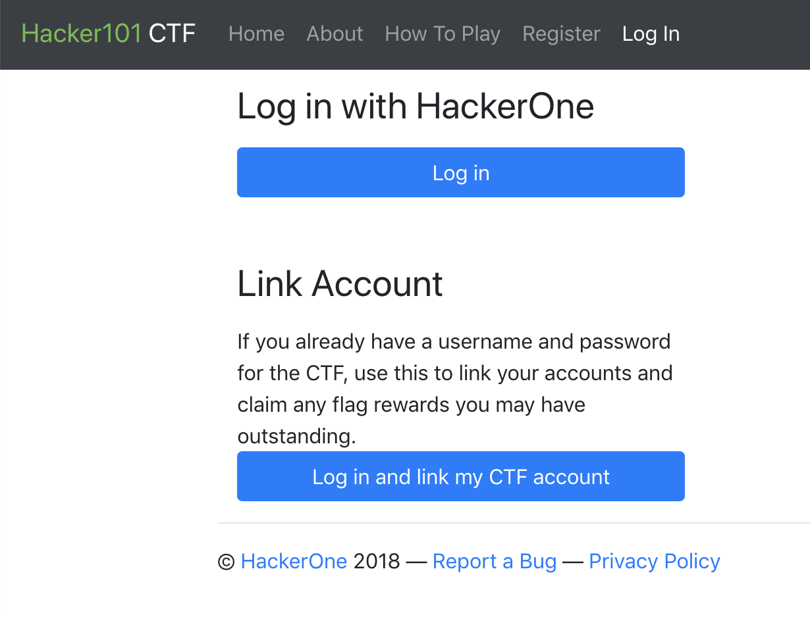
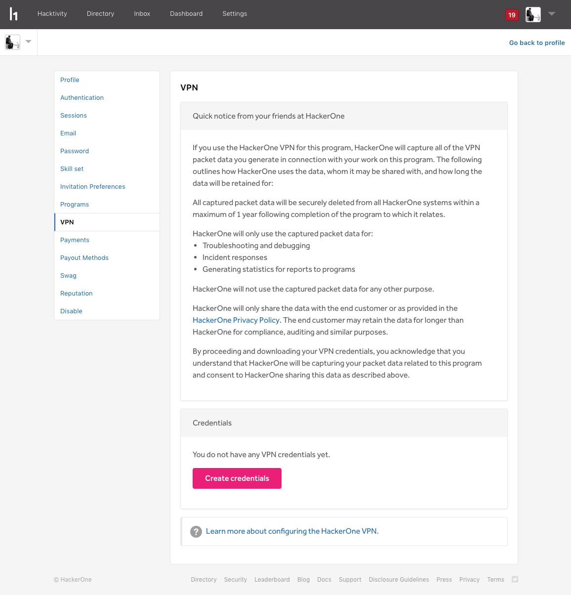

### Revamped Directory
We've totally revamped our directory page so that you can better search and view programs. You can now filter your search results by program features and by asset type, and we also enable you to view various stats for each program on one page.

### Program Bookmarking
You can now bookmark your favorite programs on the directory by starring them.

### Hacker Dashboard
Our new [Hacker Dashboard](/hackers/hacker-dashboard.html) enables hackers to better manage and review their:
* Accepted Invitations
* Pending Invitations
* Bookmarked Programs

### Hacktivity Search
We now enable you to search within Hacktivity. You can search for reports regarding programs and weaknesses you're interested to read about in the search bar to better learn how specific weaknesses were exploited in various programs.

### Disclosure
We've deprecated the term "Public Disclosure" and now simply just call it
[Disclosure](/programs/disclosure.html).

### Disclosure for Private Programs (beta)
Private programs can now opt-in to enable hackers to disclose reports to other hackers within their program. Upon disclosure, contents of the report will only be visible to participants within that private program. This enables hackers to share their vulnerability findings with other hackers in the program, and can also increase awareness for other hackers as they can better see what vulnerabilities have already been found for the program.

### Cancel Disclosure Request
We now enable you to cancel disclosure requests. You can cancel your own requests, and hackers and programs can cancel the requests they receive from one another if they choose not to disclose a report.  

### Hacker101 CTF Integration
[Hacker101 CTF](/hackers/hacker101.html) is now linked to your HackerOne account. Every time you earn 26 points in the CTF, you’ll be put in the priority queue to receive invitations to private programs. We also enable you to create your own groups to manage hackers working through the CTF.

### Activities API Endpoint
We added a new activities API endpoint that enables you to fetch all activities of your program incrementally by time. Learn more about the [activities endpoint](https://api.hackerone.com/#activities-query-activities).

### HackerOne VPN
Hackers can now configure the [HackerOne VPN](/hackers/configure-the-hackerone-vpn.html) and access their VPN credentials for VPN enabled programs.

### Retesting
We've globally launched our [retesting](/programs/retesting.html) feature so that all programs can now initiate retests on any of their resolved reports. Invitations for retests now expire after 24 hours, and hackers are now required to provide a short summary of how they retested the vulnerability. Hackers can also provide attachments of their findings.  

