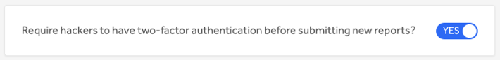
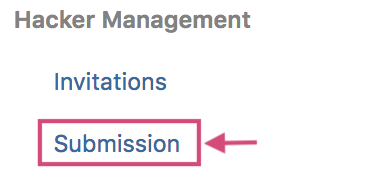
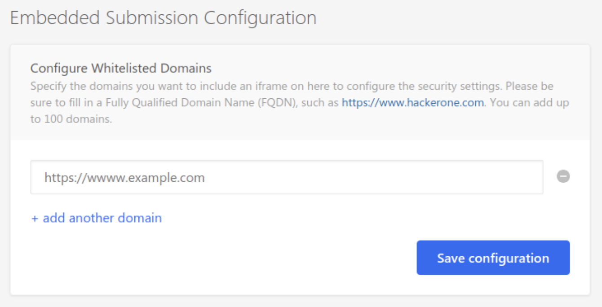

### Submission Requirements: Two-Factor Authentication
Programs can now [require](/organizations/submission.html) hackers to have two-factor authentication enabled in order to submit new reports to their program.

We've also renamed the <b>Signal Requirements</b> page under <b>Settings > Program > Hacker Management</b> to now be called <b>Submission</b>.

### Embedded Submission Form
Programs can now embed the HackerOne report submission form onto their own website. This enables hackers to submit reports without having to create an account on HackerOne. Learn more [here](/organizations/embedded-submissions-form.html).

### Sessions
Anyone can now review and manage their active HackerOne sessions on all of the devices they're signed in to on the new <b>[Sessions](/hackers/sessions.html)</b> page.

### Credential Management (beta)
We've enabled the beta [Credential Management](/organizations/credential-management.html) feature so that select programs can share credentials with hackers through the HackerOne UI. This enables hackers to quickly retrieve the credentials needed to find vulnerabilities.

### Bug Fixes
* Your active HackerOne sessions will no longer end prematurely. Sorry for that annoyance!
* We've also fixed the "Remember me" bug. Your login credentials will actually be remembered for 2 week periods so that you don't have to repeatedly log in in order to access your account.  
