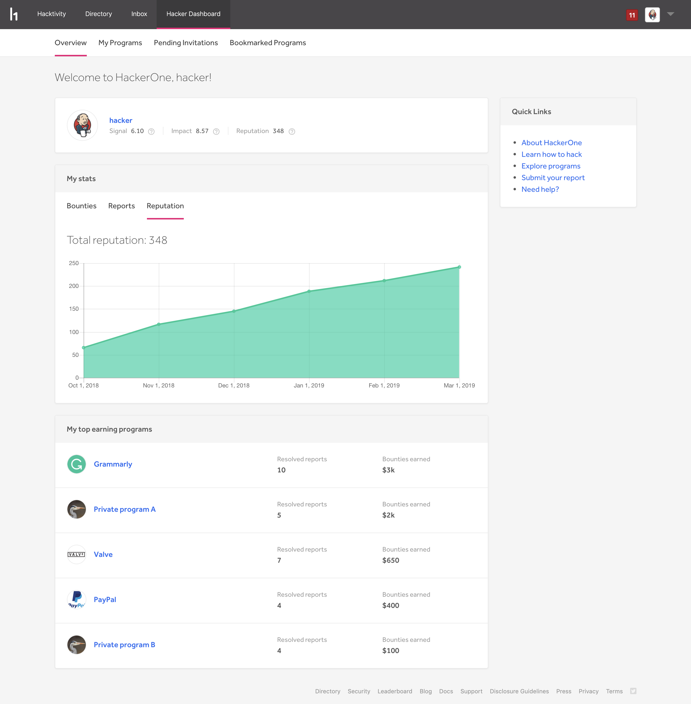
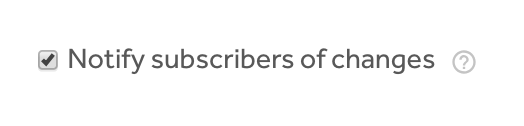

### Updates to the Hacker Dashboard
We've revamped the My Stats section of the Hacker Dashboard with expanded graphs where you can view your bounties, reports, and reputation over time. We've also included a new <b>My top earning programs</b> section to help hackers see which programs they're earning the most bounties from.

### Notifications Checkbox
Programs can now select to notify their subscribers of changes in their settings with our new **Notify subscribers of changes** checkbox. The checkbox can be found for changes to these pages:
* Policy
* Scope
* Bounties

