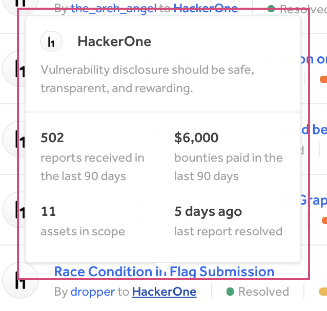

### API enhancements

We've released a few improvements to [our API](https://api.hackerone.com/docs/v1):
* [Ability to create a report](https://api.hackerone.com/docs/v1#/reports/create). This endpoint helps you to import (known) vulnerabilities into the platform, to use these for duplicate detection or central vulnerability management. 
* [Ability to fetch billing information for a program](). This endpoint includes recent transactions and the remaining balance.
* [Ability to change the weakness on a report]().
* [Ability to fetch all weaknesses for a program](https://api.hackerone.com/docs/v1#/programs/weaknesses/index).

### Program Hover State Profile

You can now better preview programs when hovering over program names with our revamped hover state profile popup. You can quickly view important information regarding the program when hovering over the program name on these pages:

* Hacktivity
* Directory
* My Programs
* Pending Invitations
* Bookmarked Programs
* Hacker Dashboard

