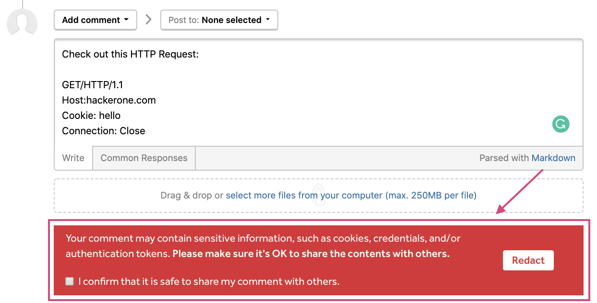

### Suggested Redaction in Report Comments
To better protect your sensitive information, we now provide a suggested redaction notification when your report comments contain sensitive information such as cookies, credentials, and authentication tokens.

### Ability to Remove Jira References
Jira users can now remove a Jira reference on a report in case they linked the wrong Jira ticket or they need to escalate the report to Jira again.
