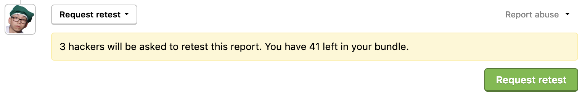
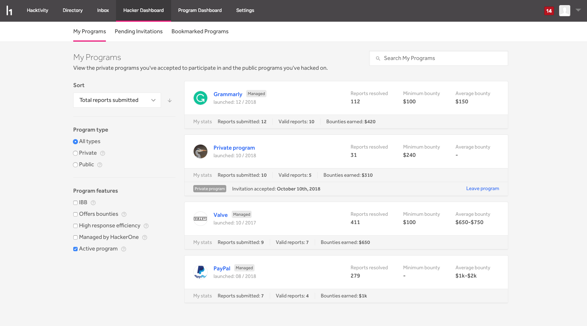
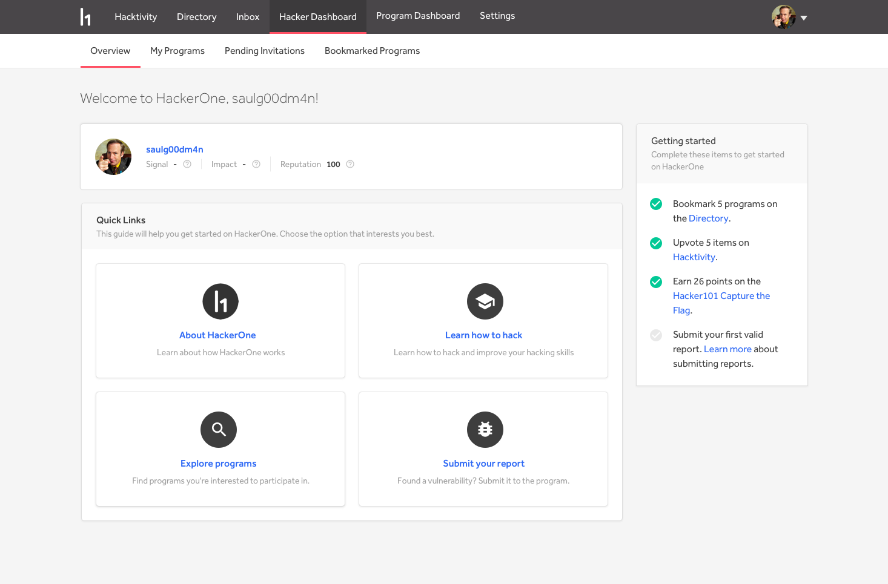
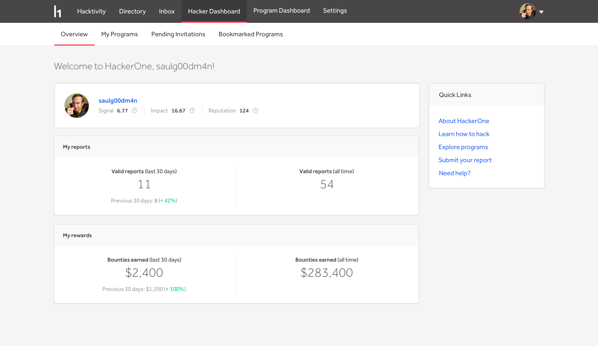

### Retesting Bundles
Programs can now opt-in to purchase a bundle of retests with their HackerOne subscription. With bundles, programs are no longer charged the processing fee for each bounty, and can also opt-in to purchase more retests when they run out.

### My Programs
We’ve renamed the Accepted Invitations page on the Hacker Dashboard to now be called My Programs. We’ve also revamped the page so that hackers can better manage all of the programs they’re a part of by including:
* More filtering options
* Sorting
* A search bar
* A *My stats* section for each program where hackers can see their personal statistics for the program

### Overview
We've renamed the Getting Started page to now be called Overview. We provide new hackers that haven't submitted any vulnerabilities with a getting started checklist with 4 tasks to complete to guide them to be more successful on the platform.    

### Hacker Statistics
After hackers have submitted their first vulnerability, they'll be able to view statistics for these personal metrics on their Overview page:
* Number of valid reports  
* Bounties earned

