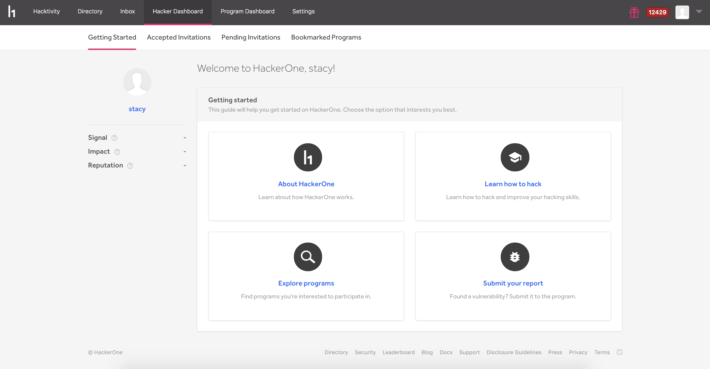
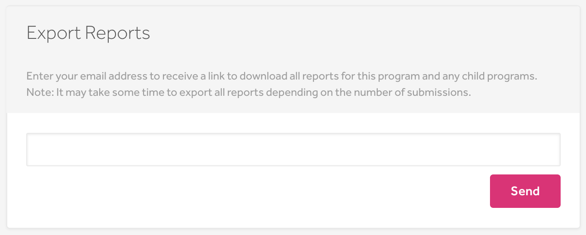
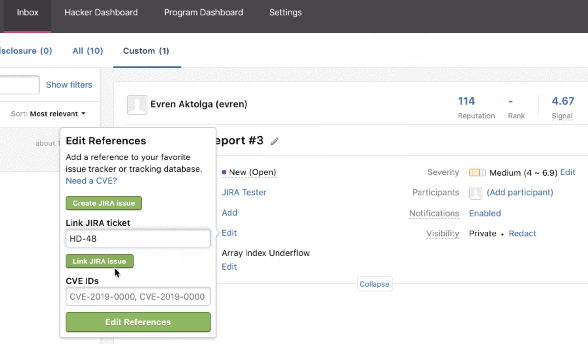
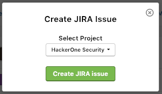
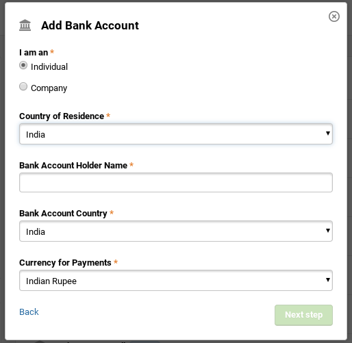
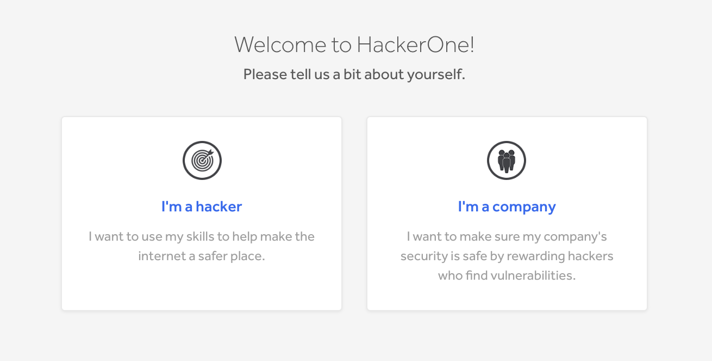
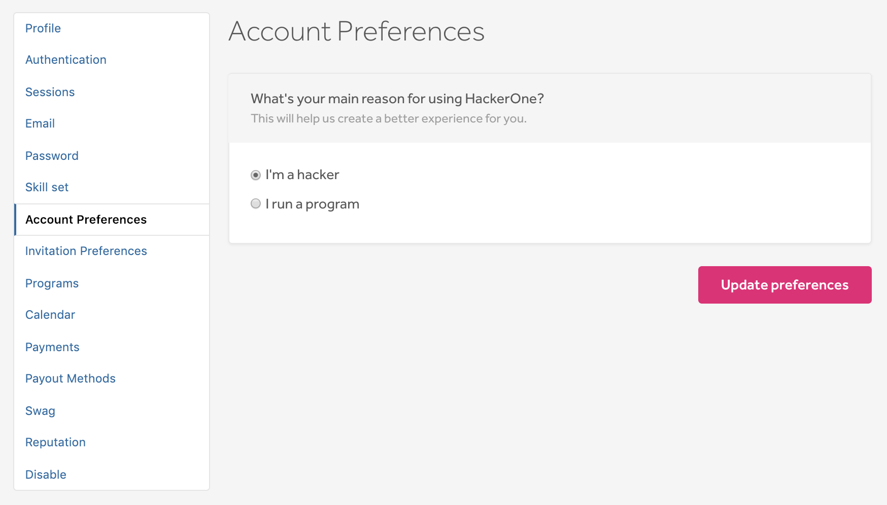
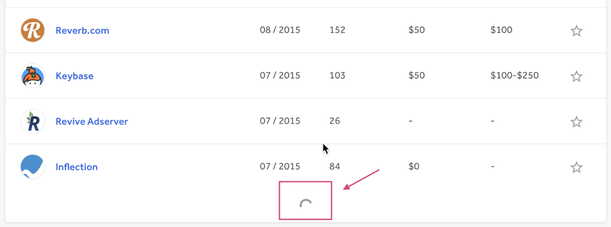

### Getting Started
We introduce the new [Getting Started](/hackers/hacker-dashboard.html) page on the Hacker Dashboard. This will guide hackers and direct them to the right pages to help them get the information they need to successfully start out on HackerOne

### Export All Reports
Want all of your report data for safe keeping or just for analytical purposes? Programs can now export all of their reports through our new [Export Reports](/programs/export-reports.html) feature.  

### Link HackerOne Reports to Existing Jira Tasks
Jira users can now [link](/programs/jira-integration.html) their HackerOne reports to their existing Jira tasks.

### Selecting From Multiple Jira Projects
Jira users can also now select from multiple projects they want their Jira task to link to.

### Indian Rupee Payments
Hackers in India will no longer lose a portion of their bounty to transfer fees as we now support payments to [Indian Rupees](https://www.hackerone.com/blog/Introducing-Indian-Rupee-payments-Cheaper-and-faster-bank-transfers).

### Improved Sign Up Page
When new users sign up to use HackerOne, they can can now more clearly distinguish whether they are a hacker or a company wanting to set up an account.  

### Account Preferences
You can now clearly define whether you're a hacker or someone running a program within the new Account Preferences tab under your profile settings. This will help tailor your HackerOne experience to better fit your needs.

### Infinite Scrolling
We've now implemented infinite scrolling on multiple pages so that you no longer have to click on the <i>Load more</i> button to view more information. The information now automatically populates.

