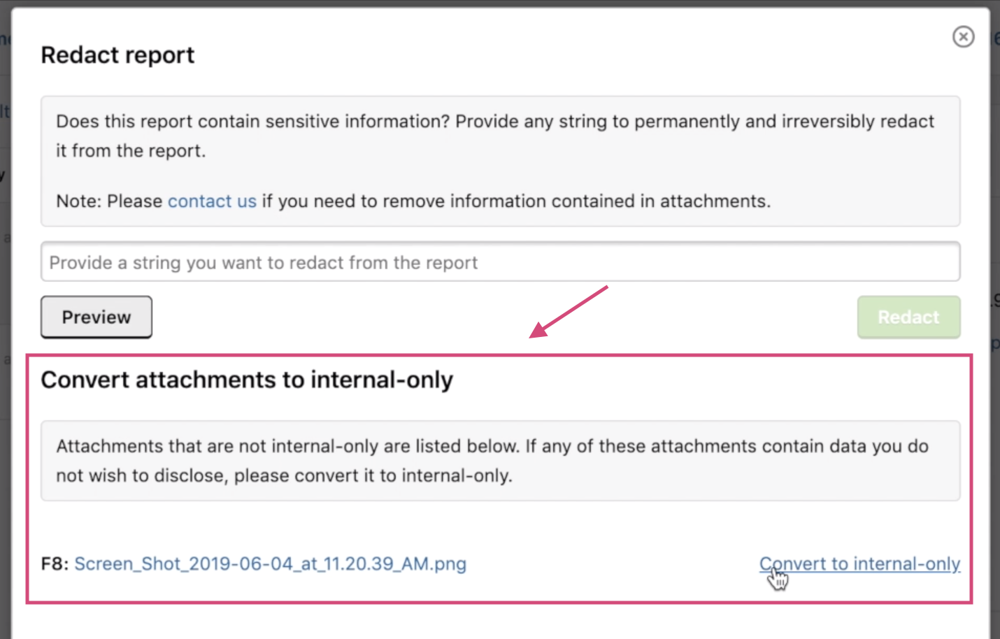

### Newly Designed Program Profile Page
We've redesigned the program profile pages to give them a sleeker look.

### Link Burp Suite with the HackerOne Scope
It can take a long time to set up Target Scope in Burp Suite, especially for programs with long or complicated scopes. Now you can download a Burp Suite project file to link HackerOne scope to the Burp Suite Target Scope.

### Bounty Eligibility Indicator on Structured Scopes
We've updated the structured scopes table on the program policy page with a new bounty eligible and ineligible icon to clearly show which assets are eligible and ineligible for bounties.

### Internal Attachments
You can convert attachments to be internal for all redactable reports in the **Convert attachments to internal-only** section when redacting a report.

### Program Notifications
After the beta launch in March, all hackers can now subscribe to receive notifications from program updates.

#### Notification Preferences
You can also now set your notification preferences under the new **Notification Preferences** page in your user settings.  

### Mentions Filter
Easily find all reports you've been mentioned in to keep track of which reports need a response from you with our new mentions filter. 

