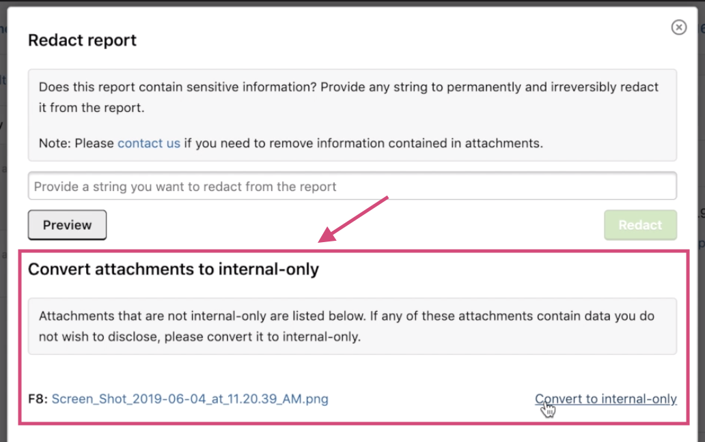

### Mark a report as ineligible for bounty when awarding swag
We introduce the new **Also mark as ineligible for bounty** checkbox so that programs can now mark a report as being ineligible for bounty when awarding swag.

Programs are also able to now award swag to reports that are marked as ineligible for bounty.

### Notifications Bell Icon
Say goodbye to the old notifications indicator next to your profile icon. We introduce a new bell icon to notify you of any new notifications. If you have more than 25 unread notifications, we've truncated the notifications number to be capped at ***25+***.

### Internal Attachments
You can convert attachments to be internal for all redactable reports in the **Convert attachments to internal-only** section when redacting a report.

