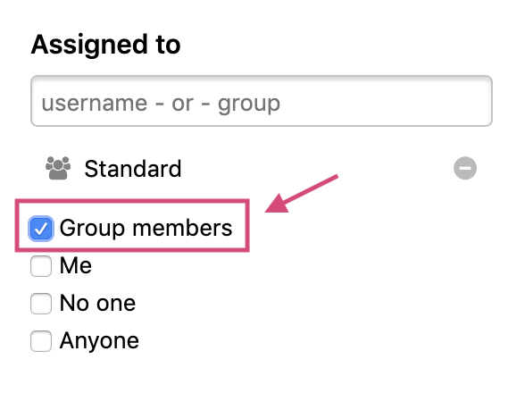

### Custom Fields

After the beta launch in March, [custom fields](/programs/custom-fields.html) is now available to all Enterprise programs.  

### Mark a report as ineligible for bounty when awarding swag
We introduce the new **Also mark as ineligible for bounty** checkbox so that programs can now mark a report as being ineligible for bounty when awarding swag.

Programs are also able to now award swag to reports that are marked as ineligible for bounty.

### Notifications Bell Icon
Say goodbye to the old notifications indicator next to your profile icon. We introduce a new bell icon to notify you of any new notifications. If you have more than 25 unread notifications, we've truncated the notifications number to be capped at ***25+***.

### Saving the Inbox Sort Order
Say goodbye to having to always re-select how you want your inbox sorted. Your selected sort order will now automatically save when creating your custom inbox view.  

### Submission Date Filters
You can now filter through your inbox reports by submission date in order to quickly find reports submitted after or within a certain time.

### Group Members Filter
The new Group Members filter enables you to search for reports by individual members within a group. Previously, you couldn’t see which members were assigned to which reports within the group. This enables you to better keep track of reports and the individuals assigned to them.   

### Goodbye to the Insights Tab
We’ve deprecated the Insights tab from program pages.

