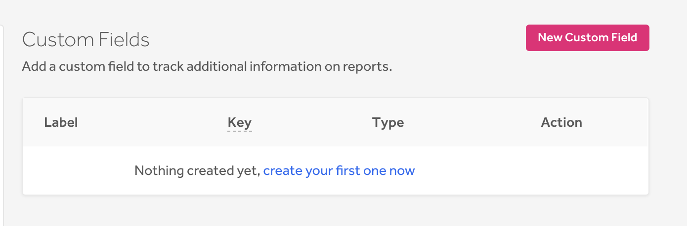

### Custom Fields (beta)
We introduce [custom fields](/programs/custom-fields.html) to enable programs to add custom information to their reports to help them better manage and analyze their internal data by the categories that they define to be important. This feature is only available for Enterprise programs.

### Custom Fields on the API
We've also added custom fields to the API to enable programs to search and filter reports by [custom field values](https://api.hackerone.com/#reports-manage-custom-field-values).     

### Program Notifications (beta)
Select hackers now receive program notifications to all program updates via the product and email for changes to the:
* Policy
* Bounty table
* Scope
* Hacker messages

We've also implemented a new **Subscribe** button on the policy page to enable hackers to easily subscribe to program notifications. *Note: The button is currently viewable for select hackers.*

### Deprecation of Custom Recipients for Messaging Hackers
We've deprecated the *Custom* recipient field on the Message Hackers page as the feature wasn't found to be very valuable for programs.
