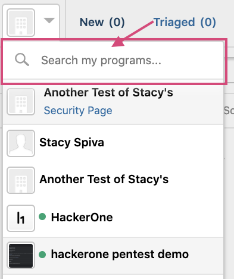
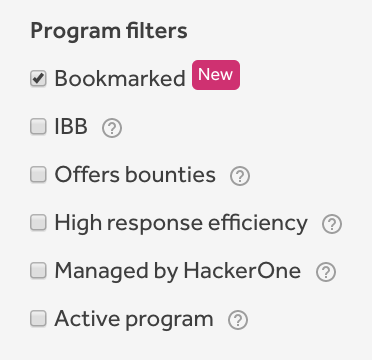
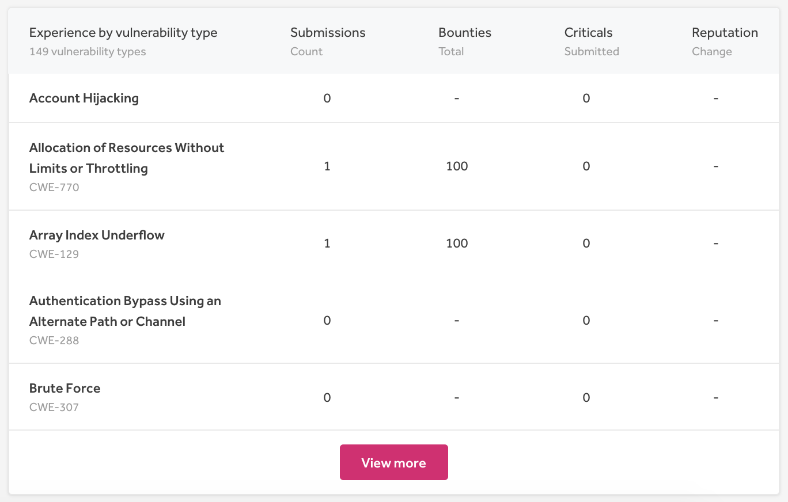
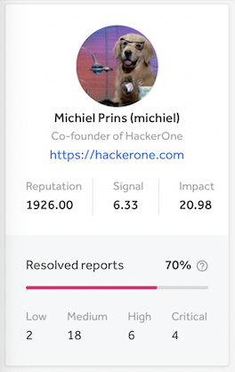

### Inbox Program Search
If you're managing or are a part of many programs, you can now search the inbox by program name with our new search field. The search field is visible for everyone who is a part of 5 or more programs.

### New Program Filter: Bookmarked
We added the new **Bookmarked** program filter to the **My Programs** tab so that hackers can view their bookmarked programs on the same page.

### Experience by Vulnerability Type
We added an **Experience by vulnerability type** section to the **Overview** page of the **Hacker Dashboard** so that hackers can see the analytics of which vulnerability types they're most successful in finding.  

### Modified Hacker Dashboard Layout
We modified the layout of the profile section of the Hacker Dashboard and also expanded it with metrics on resolved reports that enables hackers to understand the percentage of their report submissions that are resolved.

###
