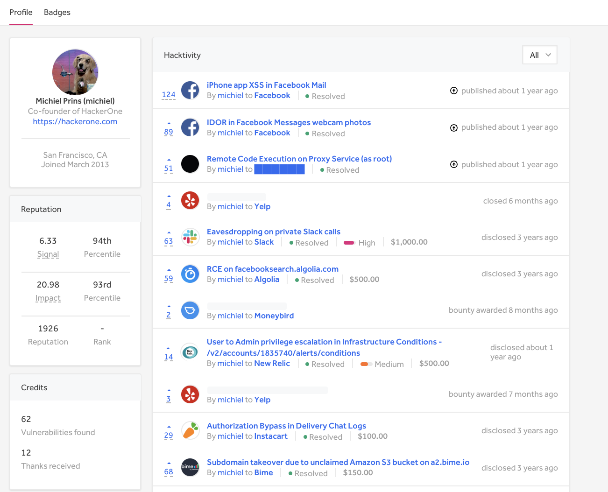
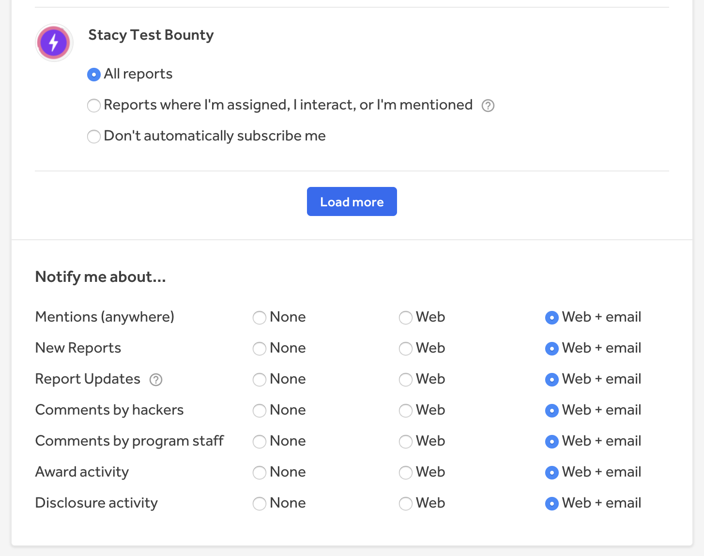
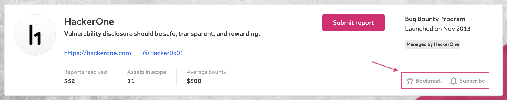
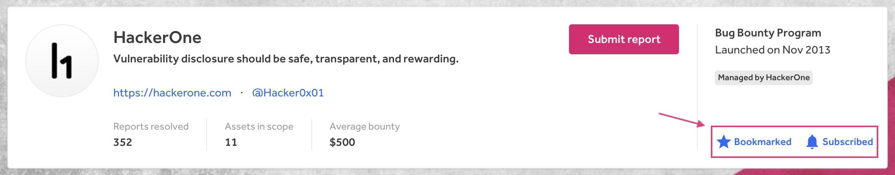

### Hacker Profile Redesign
We've redesigned the hacker profile page to simplify the UI. In doing so, we've deprecated the **Thanks** tab and put the **Thanks** section at the bottom of the profile page.

### New Settings on Notification Preferences
We've revamped the Notification Preferences page and added new settings so that all users can better customize their report notifications to reduce noise from unwanted notifications.

### Program Page Bookmark and Subscribe Buttons
We've deprecated the **Follow** button on the Program Page and replaced it with a **Bookmark** button. We also moved the **Subscribe** button from the bottom of the Program Page and moved it to the top next to the new **Bookmark** button so that hackers can easily subscribe to program updates and add programs to their bookmarked program list on their dashboard.   

 

 

### API Enhancements
We've released the following improvements to our [API](https://api.hackerone.com/#introduction):
* [Filtering reports by weaknesses](https://api.hackerone.com/#reports-get-all-reports)
* [Filtering reports by severities](https://api.hackerone.com/#reports-get-all-reports)
* [Fetching program payment transactions](https://api.hackerone.com/#programs-get-payment-transactions)
* [Getting a program's balance](https://api.hackerone.com/#programs-get-balance)
* [Fetching a program's thanks items](https://api.hackerone.com/#programs-get-thanks-to-hackers)
* [Updating report structured scope](https://api.hackerone.com/#reports-update-structured-scope)
* [Filtering reports by keywords](https://api.hackerone.com/#reports-get-all-reports)
* [Fetching awarded program swag](https://api.hackerone.com/#programs-get-awarded-swag)
* [Fetching bounty suggestions](https://api.hackerone.com/#reports-get-bounty-suggestions)
* [Fetching program policy and attachments](https://api.hackerone.com/#programs-get-program)
* [Requesting and cancelling report disclosure](https://api.hackerone.com/#core-resources-reports-manage-disclosure-request)
* [Redacting reports](https://api.hackerone.com/#core-resources-reports-redact)
* [Groups attribute to member object](https://api.hackerone.com/#core-resources-programs-get-program)
* [Uploading attachments to the policy page](https://api.hackerone.com/core-resources/#programs-upload-policy-attachment)
