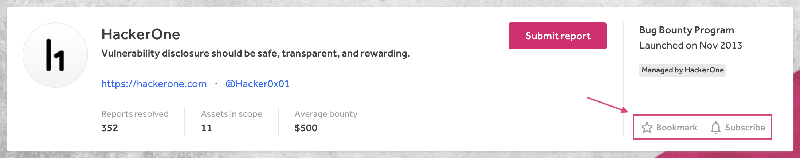

### Program Page Bookmark and Subscribe Buttons
We've deprecated the **Follow** button on the Program Page and replaced it with a **Bookmark** button. We also moved the **Subscribe** button from the bottom of the Program Page and moved it to the top next to the new **Bookmark** button so that hackers can easily subscribe to program updates and add programs to their bookmarked program list on their dashboard.   

 

 

### API Enhancements
We've released the following improvements to our [API](https://api.hackerone.com/#introduction):
* [Enabled filtering reports by weaknesses](https://api.hackerone.com/#reports-get-all-reports)
* [Added endpoint for fetching program payment transactions](https://api.hackerone.com/#programs-get-payment-transactions)
