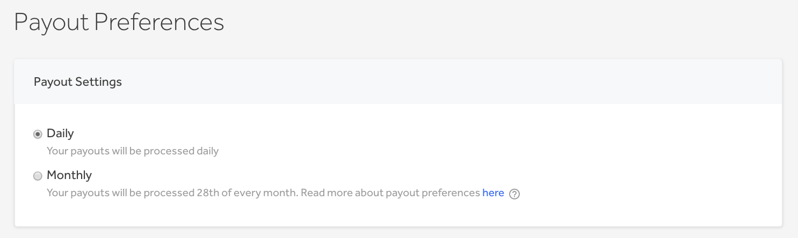
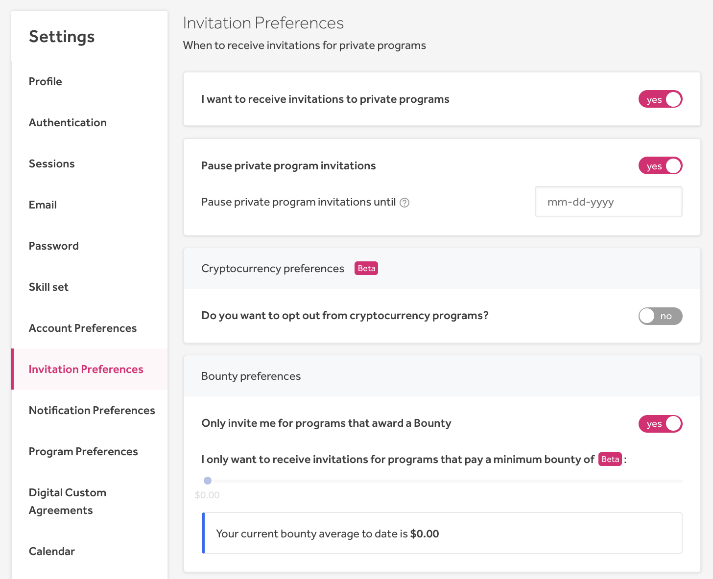

### Monthly Payouts
Hackers can now choose to receive their [payouts](/hackers/payout-methods.html) monthly instead of daily, so that they can receive all their payments from the month in 1 batch payment.

### Revamped Invitation Preferences
We've revamped the [Invitation Preferences](/hackers/invitations.html#invitation-preferences) page with more options to specify and control your invitation settings. 

### Hacker Following
In order to keep up-to-date with your favorite hackers, we introduce the new [Hacker Following](/hackers/following.html) feature. This enables you to keep track of your favorite hackers and to quickly see their activity on HackerOne.

You can filter the activity of the hackers you're following with our new **Hackers I am following** filter on the Hacktivity page.

We also introduce the Followed Hackers page on the Hacker Dashboard to help you manage the hackers you're following.

