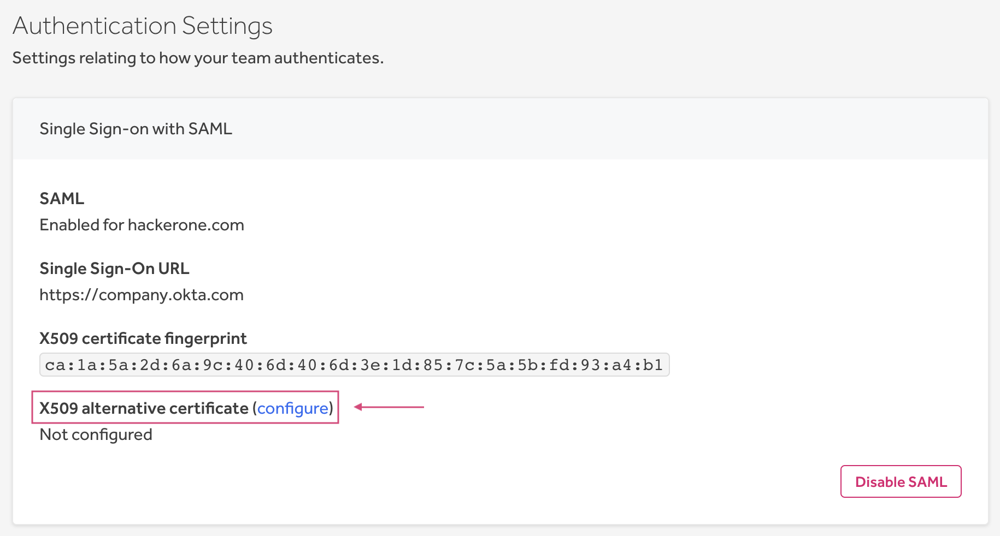

### Configure an Alternative Certificate for SAML
If you need to switch your identity provider or if your current SAML certificate is expiring, you can now [configure an alternative certificate](/organizations/single-sign-on-sso-via-saml.html#configure-an-alternative-certificate) to avoid having to disable your SSO integration.

