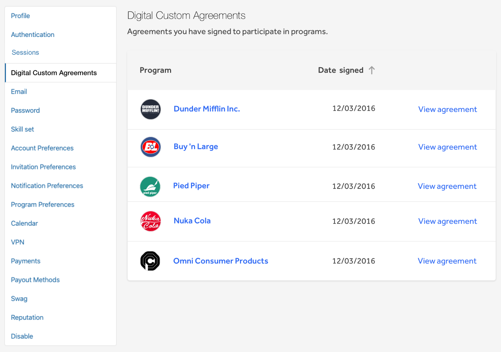

### Hacker Full Name and Addresses in Custom Agreements
Programs can now request hackers to provide their full name and address when accepting the [Digital Custom Agreement](/programs/advanced-vetting.html#digital-customizable-agreements).

### Digital Custom Agreements
Hackers can now view their signed custom agreements on the new **Digital Custom Agreements** page within their profile settings.

### Set up a Jira Integration without Jira Admin Permissions
To simplify the set up process, programs can now set up their Jira Integration without needing Jira Administrator permissions.
