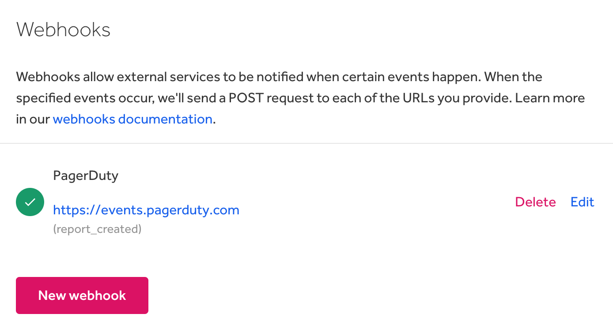

### Webhooks
Enterprise programs can now utilize [webhooks](/organizations/webhooks.html) to build real-time integrations that subscribe to certain report and program events on HackerOne.

### PagerDuty Integration
Enterprise programs can also now [integrate PagerDuty](/organizations/pagerduty-integration.html) with HackerOne so that each time an [event](https://api.hackerone.com/webhooks/#events) is triggered in HackerOne, a PagerDuty incident can automatically be created.

### Reputation, Signal and Impact Calculation Enhancements
We've made these changes to how [reputation](/hackers/reputation.html), [signal and impact](/hackers/signal-and-impact.html) are calculated:  
* The first 10 bounties of a program will now be rewarded with the BOUNTY\_LOW reputation instead of the BOUNTY\_MEDIUM. After 10 bounties have been paid out, a hacker’s reputation will be recalculated based on the standard deviation of the program’s mean bounty.
* Reports marked as *Informative* are now **not** included in the calculation of Signal.
* All hacker's signal for [signal requirements](/hackers/restricted-from-submissions.html#signal-requirements) will now be based on the last 365 days so that hackers won't be penalized for their past performance affecting their signal.
