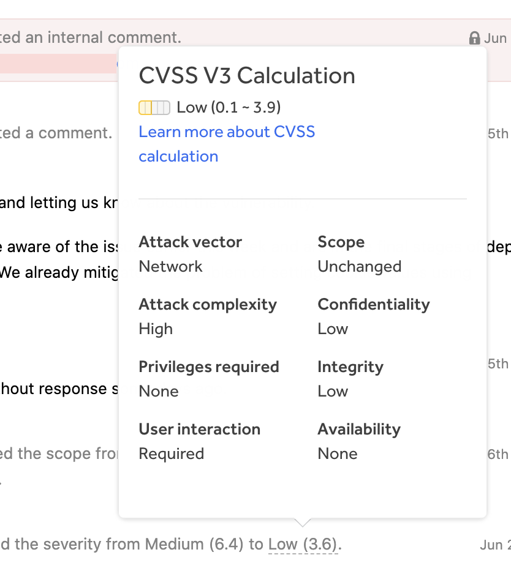
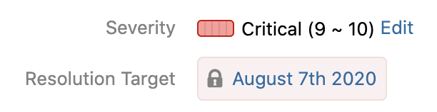
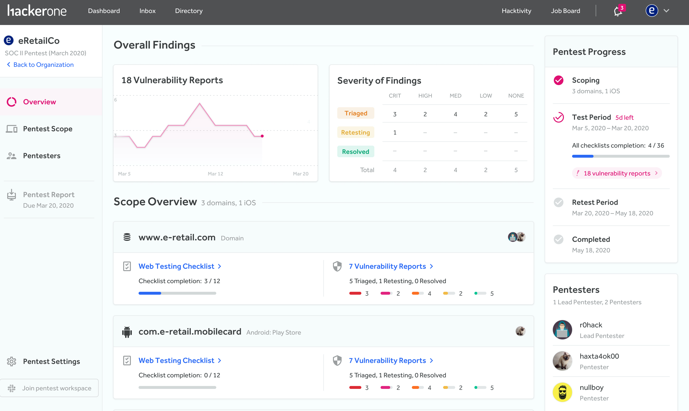

### Inline Report CVSS Details
We now show the updated CVSS details within the report activity when a program decides to change the severity level of a vulnerability.

### Resolution Target Date in Report Header
We've added a new [**Resolution Target**](/organizations/response-target-metrics.html) field in the report header for all triaged reports. This enables members of the program's response team to clearly see when they should aim to resolve the report by. The date is calculated based off of what the program's [response target settings](/organizations/setting-response-targets.html) are set to.  

### HackerOne Pentest
We've officially launched [Pentests](/organizations/pentests.html) as a new product offering to help companies better secure their applications and meet regulatory compliance standards.

